# AI驱动测试用例生成与自动化脚本生成流程设计

## 一、整体流程架构

```
┌──────────────────┐     ┌──────────────────┐     ┌──────────────────┐     ┌──────────────────┐
│   BSD/需求文档    │────▶│   AI解析与分析    │────▶│   测试用例生成   │────▶│   Review审核     │
│   (输入)          │     │   (智能理解)      │     │   (自动化)       │     │   (人工/AI)      │
└──────────────────┘     └──────────────────┘     └──────────────────┘     └────────┬─────────┘
                                                                                   │
                                                                                   ▼ (通过)
┌──────────────────┐     ┌──────────────────┐     ┌──────────────────┐     ┌──────────────────┐
│   脚本生成引擎    │◀────│   用例模板匹配    │◀────│   测试框架选择   │◀────│   脚本配置       │
│   (代码生成)      │     │   (映射转换)      │     │   (Web 2C/2B/API)│     │   (参数设置)     │
└────────┬─────────┘     └──────────────────┘     └──────────────────┘     └──────────────────┘
         │
         ▼
┌──────────────────┐     ┌──────────────────┐     ┌──────────────────┐
│   测试编排引擎    │────▶│   测试执行引擎    │────▶│   结果分析报告   │
│   (编排调度)      │     │   (并行执行)      │     │   (智能分析)      │
└──────────────────┘     └──────────────────┘     └──────────────────┘
```

---

## 二、BSD解析与AI分析模块

### 2.1 输入数据类型

| 数据类型 | 格式 | 说明 |
|---------|------|------|
| **BSD文档** | PDF/DOCX/Markdown/TXT | 产品需求文档 |
| **JIRA需求** | JIRA API/导出文件 | 敏捷项目管理平台需求 |
| **Lark文档** | Lark API/导出文件 | 飞书文档 |
| **接口文档** | Swagger/OpenAPI | API接口定义 |
| **UI设计稿** | Figma/Sketch/Axure/墨刀 | 界面设计文件 |
| **原型图** | Axure/墨刀/Figma | 交互原型 |
| **截图** | PNG/JPG/GIF | 需求截图/标注图 |
| **表格数据** | Excel/CSV | 需求矩阵/测试数据 |
| **历史测试用例** | Excel/XML/JSON | 参考用例库 |
| **MCP配置** | JSON/YAML | MCP协议配置文件 |

### 2.2 AI解析流程

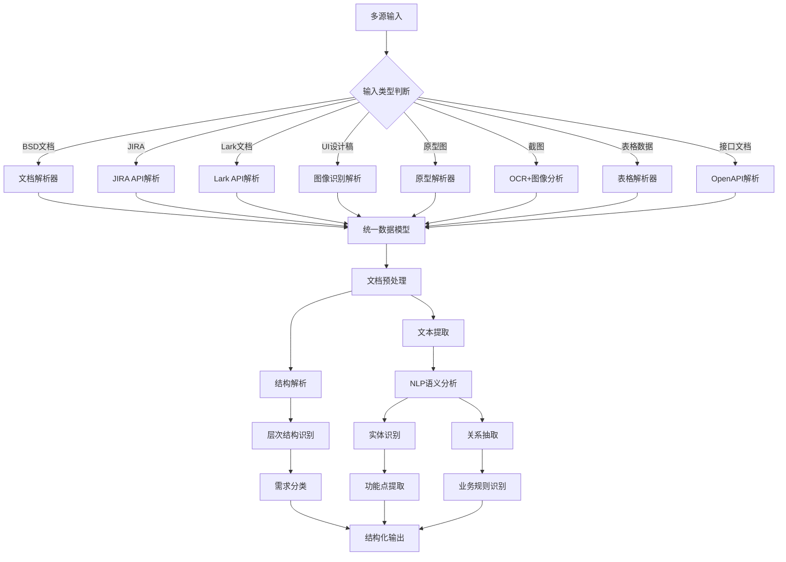

### 2.3 LLM提示词设计

**系统提示词：**
```
你是一个专业的测试分析师，擅长从需求文档中提取测试要点。

分析步骤：
1. 识别核心功能模块
2. 提取业务规则和约束条件
3. 分析用户交互流程
4. 识别边界条件和异常场景
5. 生成测试用例大纲
6. 识别MCP集成点和UI交互场景

输出格式要求：
- JSON格式
- 包含用例ID、测试场景、前置条件、测试步骤、预期结果
- 用例类型标注：功能测试、边界测试、异常测试、性能测试、冒烟测试、E2E测试、回归测试
- MCP相关用例需要标注MCP工具调用和上下文传递
```

**用户提示词模板：**
```
请分析以下需求来源，生成完整的测试用例：

需求来源类型：{SOURCE_TYPE}  // BSD文档/JIRA/Lark/UI设计稿/原型图/截图/表格/接口文档

需求内容：
{BSD_CONTENT}

附加信息：
- 截图描述：{IMAGE_DESCRIPTION}
- 原型链接：{PROTOTYPE_URL}
- JIRA Issue：{JIRA_ISSUE_KEY}
- Lark文档：{LARK_DOC_URL}
- 设计稿：{FIGMA_URL}

额外约束：
- 系统响应时间要求 < 200ms
- 支持1000并发用户
- 数据需要持久化存储
- 需要支持MCP协议集成
- 需要覆盖冒烟测试场景
- 需要覆盖E2E全流程测试
- 需要支持回归测试编排

请输出结构化的测试用例JSON。
```

### 2.4 输出数据结构

```json
{
  "document_info": {
    "title": "用户登录模块需求",
    "version": "1.0",
    "analysis_time": "2024-01-15T10:30:00"
  },
  "requirements": [
    {
      "id": "REQ-001",
      "title": "用户登录功能",
      "description": "用户通过邮箱和密码登录系统",
      "priority": "high",
      "test_points": ["邮箱格式验证", "密码强度验证", "登录失败次数限制"],
      "mcp_integration": {
        "enabled": true,
        "tools": ["auth-service", "user-profile"],
        "context_flow": ["login_request", "user_context", "session_token"]
      }
    }
  ],
  "business_rules": [
    {
      "id": "RULE-001",
      "rule": "密码长度至少6位",
      "severity": "high"
    }
  ],
  "data_flow": [
    {"source": "登录页面", "action": "提交登录", "target": "后端API", "data": "email, password"}
  ],
  "test_categories": {
    "smoke_tests": ["登录功能可用性", "核心页面加载"],
    "e2e_tests": ["用户注册到下单完整流程"],
    "regression_tests": ["历史缺陷验证", "核心功能回归"]
  }
}
```

---

## 三、测试用例生成模块

### 3.1 用例生成策略

| 策略类型 | 描述 | 适用场景 |
|---------|------|---------|
| **等价类划分** | 将输入划分为等价类，从每个类中选代表 | 输入验证类测试 |
| **边界值分析** | 测试边界条件附近的值 | 数值范围验证 |
| **因果图法** | 分析输入输出的因果关系 | 复杂逻辑测试 |
| **场景法** | 模拟用户实际操作场景 | 流程测试 |
| **错误推测** | 基于经验推断可能的错误 | 异常场景测试 |
| **MCP场景分析** | 分析MCP工具调用和上下文传递 | MCP集成测试 |
| **冒烟测试策略** | 识别核心功能快速验证点 | 冒烟测试 |
| **E2E路径分析** | 分析完整业务流程路径 | 端到端测试 |

### 3.2 AI用例生成流程

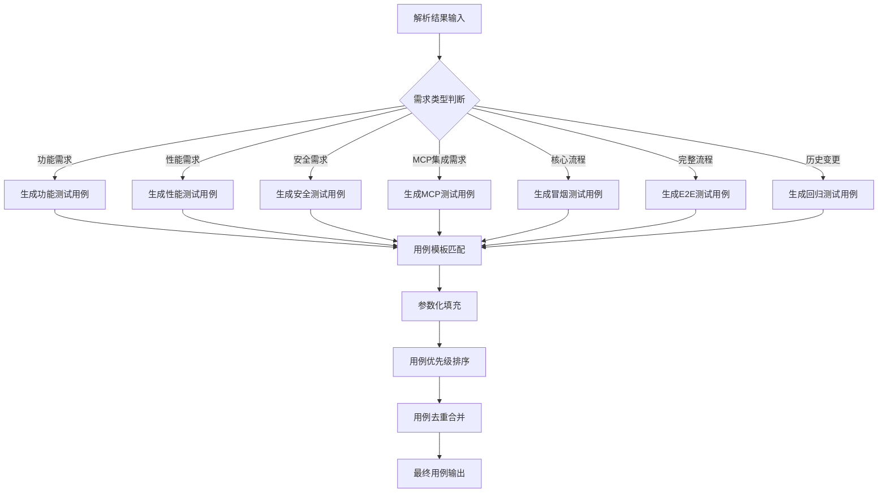

### 3.3 测试用例数据模型

```json
{
  "test_cases": [
    {
      "case_id": "TC-LOGIN-001",
      "module": "用户登录",
      "title": "正常登录-邮箱密码正确",
      "type": "功能测试",
      "category": "smoke",
      "priority": "P0",
      "preconditions": ["系统处于正常运行状态", "用户已注册"],
      "test_data": {
        "email": "test@example.com",
        "password": "123456",
        "expected_url": "https://admin.example.com/dashboard",
        "expected_user": "test@example.com"
      },
      "test_steps": [
        {"step": "打开登录页面", "expected": "登录页面显示正常", "actual": null},
        {"step": "输入邮箱: ${test_data.email}", "expected": "邮箱输入成功", "actual": null},
        {"step": "输入密码: ${test_data.password}", "expected": "密码输入成功", "actual": null},
        {"step": "点击登录按钮", "expected": "成功跳转到${test_data.expected_url}", "actual": null}
      ],
      "expected_result": "用户成功登录系统，页面跳转到仪表盘，显示用户邮箱",
      "actual_result": null,
      "postconditions": ["用户状态为已登录"],
      "tags": ["smoke", "regression", "mcp"],
      "estimated_time": "1分钟",
      "mcp_config": {
        "enabled": true,
        "tools": [
          {
            "name": "auth-service",
            "action": "login",
            "params": {"email": "${test_data.email}", "password": "${test_data.password}"}
          }
        ],
        "context_validation": ["user_id", "session_token"]
      }
    },
    {
      "case_id": "TC-LOGIN-002",
      "module": "用户登录",
      "title": "登录失败-密码错误",
      "type": "功能测试",
      "category": "smoke",
      "priority": "P1",
      "preconditions": ["系统处于正常运行状态", "用户已注册"],
      "test_data": {
        "email": "test@example.com",
        "password": "wrongpassword",
        "expected_error": "邮箱或密码错误",
        "expected_error_code": "AUTH-001"
      },
      "test_steps": [
        {"step": "打开登录页面", "expected": "登录页面显示正常", "actual": null},
        {"step": "输入邮箱: ${test_data.email}", "expected": "邮箱输入成功", "actual": null},
        {"step": "输入密码: ${test_data.password}", "expected": "密码输入成功", "actual": null},
        {"step": "点击登录按钮", "expected": "显示错误提示: ${test_data.expected_error}", "actual": null}
      ],
      "expected_result": "登录失败，显示错误提示信息，用户停留在登录页面",
      "actual_result": null,
      "postconditions": ["用户状态为未登录"],
      "tags": ["smoke", "regression"],
      "estimated_time": "1分钟"
    },
    {
      "case_id": "TC-E2E-001",
      "module": "电商全流程",
      "title": "用户注册到下单完整流程",
      "type": "E2E测试",
      "category": "e2e",
      "priority": "P0",
      "preconditions": ["系统正常运行", "数据库已初始化"],
      "test_data": {
        "user": {
          "email": "new_user@example.com",
          "password": "Password@123",
          "name": "测试用户"
        },
        "product": {
          "id": "PROD-001",
          "name": "测试商品",
          "price": 99.99,
          "quantity": 1
        },
        "expected_order_status": "pending_payment",
        "expected_total_amount": 99.99
      },
      "test_steps": [
        {"step": "用户注册", "expected": "注册成功，自动登录", "actual": null},
        {"step": "浏览商品列表", "expected": "商品列表正常显示", "actual": null},
        {"step": "选择商品${test_data.product.id}", "expected": "商品详情页显示", "actual": null},
        {"step": "添加商品到购物车", "expected": "购物车数量+1", "actual": null},
        {"step": "进入结算页面", "expected": "结算信息正确", "actual": null},
        {"step": "提交订单", "expected": "订单创建成功，订单状态为${test_data.expected_order_status}", "actual": null}
      ],
      "expected_result": "用户从注册到下单的完整流程成功，订单创建并处于待支付状态",
      "actual_result": null,
      "postconditions": ["订单状态为${test_data.expected_order_status}", "用户余额未扣减"],
      "tags": ["e2e", "smoke", "critical"],
      "estimated_time": "5分钟"
    },
    {
      "case_id": "TC-REGRESSION-001",
      "module": "历史缺陷验证",
      "title": "验证缺陷#1234修复情况",
      "type": "回归测试",
      "category": "regression",
      "priority": "P1",
      "preconditions": ["系统正常运行"],
      "test_data": {
        "bug_id": "BUG-1234",
        "reproduction_steps": ["步骤1", "步骤2", "步骤3"],
        "expected_behavior": "缺陷已修复，不再出现"
      },
      "test_steps": [
        {"step": "执行缺陷复现步骤1", "expected": "步骤1执行正常", "actual": null},
        {"step": "执行缺陷复现步骤2", "expected": "步骤2执行正常", "actual": null},
        {"step": "执行缺陷复现步骤3", "expected": "${test_data.expected_behavior}", "actual": null}
      ],
      "expected_result": "缺陷#1234已修复，按照复现步骤执行后不再出现问题",
      "actual_result": null,
      "tags": ["regression", "bug-1234"],
      "estimated_time": "2分钟",
      "related_bug": "BUG-1234"
    }
  ],
  "metadata": {
    "total_cases": 50,
    "smoke_count": 8,
    "e2e_count": 5,
    "regression_count": 20,
    "mcp_count": 12,
    "p0_count": 10,
    "p1_count": 25,
    "p2_count": 15,
    "generated_by": "GPT-4",
    "generated_time": "2024-01-15T11:00:00"
  }
}
```

---

## 四、测试用例Review流程

### 4.1 Review架构

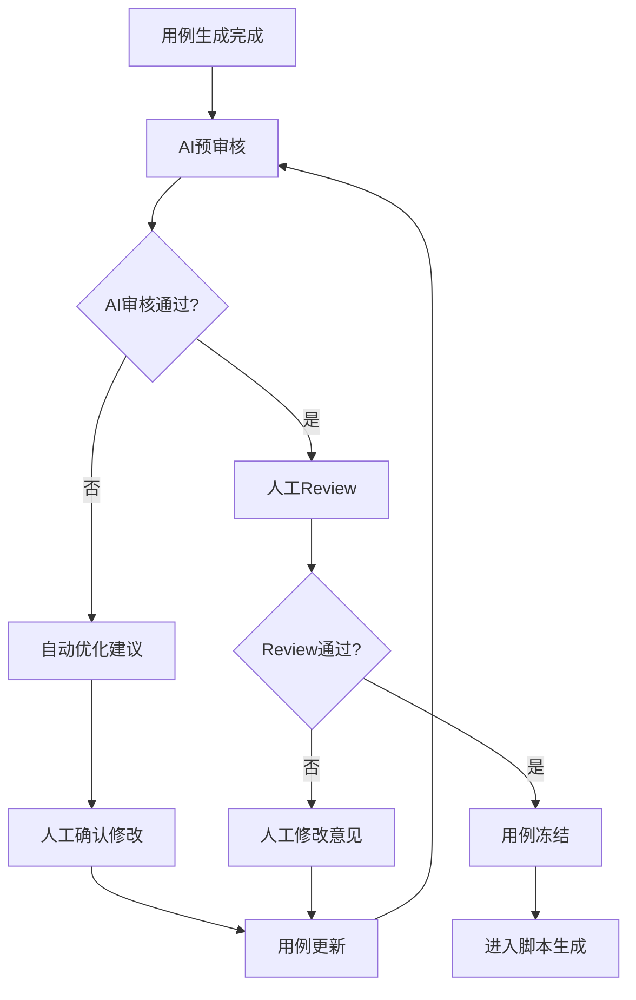

### 4.2 AI预审核规则

| 审核项 | 检查规则 | 严重级别 |
|-------|---------|---------|
| **完整性** | 每个需求点是否有对应用例覆盖 | 高 |
| **正确性** | 测试步骤与预期结果是否匹配 | 高 |
| **可执行性** | 步骤是否清晰、可操作 | 中 |
| **覆盖率** | 是否覆盖正常/边界/异常场景 | 中 |
| **重复检测** | 是否存在重复或冗余用例 | 低 |
| **优先级合理** | 优先级分配是否合理 | 低 |
| **MCP配置正确性** | MCP工具调用和上下文传递是否正确 | 高 |
| **冒烟测试覆盖** | 核心功能是否有冒烟测试覆盖 | 高 |
| **E2E流程完整性** | E2E测试是否覆盖完整业务流程 | 中 |
| **回归测试关联** | 回归测试是否关联历史缺陷 | 中 |

### 4.3 Review表单模板

```markdown
## 测试用例Review表

| 用例ID | 标题 | 类型 | 审核人 | 状态 | 意见 |
|-------|------|------|-------|------|------|
| TC-001 | 正常登录 | 功能测试 | 张三 | ✅ 通过 | - |
| TC-002 | 密码错误登录 | 功能测试 | 张三 | ⚠️ 需要修改 | 建议增加错误次数限制验证 |
| TC-003 | 空密码登录 | 功能测试 | 张三 | ✅ 通过 | - |
| TC-E2E-001 | 注册到下单流程 | E2E测试 | 张三 | ✅ 通过 | - |
| TC-REGRESSION-001 | 缺陷#1234验证 | 回归测试 | 张三 | ✅ 通过 | - |

**总体评价:**
- 用例覆盖率: 95%
- 冒烟测试覆盖: 100%
- E2E测试覆盖: 90%
- 回归测试覆盖: 85%
- MCP配置正确性: 100%
- 建议修改用例数: 1
- 审核结论: 🔄 需要修订

**审核签名:** ____________
**审核日期:** ____________
```

---

## 五、自动化脚本生成模块

### 5.1 脚本生成架构

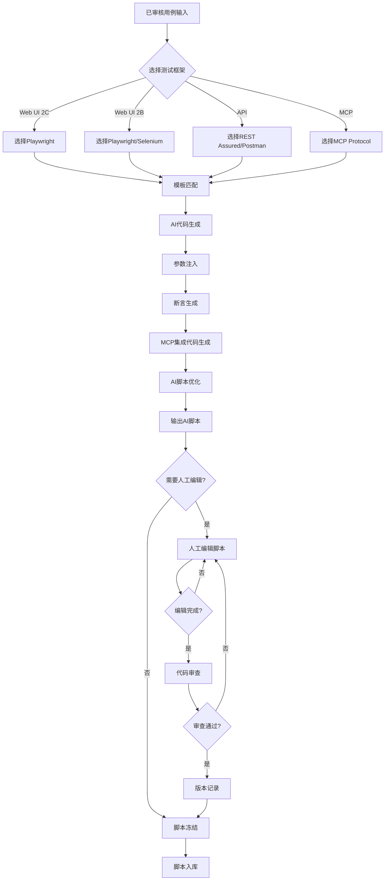

### 5.2 支持的测试框架

| 类型 | 框架 | 语言 | 适用场景 |
|-----|------|------|---------|
| **Web UI (2C)** | Playwright | JavaScript/TypeScript | 面向消费者的Web应用测试 |
| **Web UI (2B)** | Playwright | JavaScript/TypeScript | 面向企业的Web应用测试 |
| **Web UI (Legacy)** | Selenium | Java/Python/JS | 遗留系统Web测试 |
| **API** | REST Assured | Java | API自动化测试 |
| **API** | Postman | JavaScript | API测试与文档 |
| **MCP** | MCP Protocol | TypeScript/Python | MCP工具集成测试 |

### 5.3 人工编辑与协作机制

#### 5.3.1 人工编辑流程

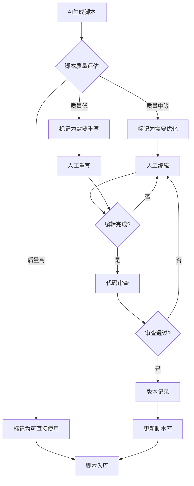

#### 5.3.2 脚本编辑器功能

| 功能 | 描述 | 支持操作 |
|-----|------|---------|
| **在线编辑** | Web端实时编辑脚本 | 代码高亮、自动补全、语法检查 |
| **AI辅助** | AI提供编辑建议 | 代码优化、错误修复、最佳实践建议 |
| **版本对比** | 查看脚本版本差异 | Diff视图、回滚到历史版本 |
| **协作编辑** | 多人同时编辑 | 实时同步、冲突解决、评论功能 |
| **代码审查** | Pull Request 流程 | 代码评审、审批流程 |
| **执行预览** | 在线执行预览 | 单步调试、断点设置、变量查看 |

#### 5.3.3 人工编辑配置

```json
{
  "script_editing_config": {
    "enabled": true,
    "edit_modes": {
      "online_editor": {
        "enabled": true,
        "features": [
          "syntax_highlighting",
          "auto_completion",
          "linting",
          "formatting",
          "ai_suggestions"
        ]
      },
      "ide_integration": {
        "enabled": true,
        "supported_ides": ["VSCode", "WebStorm", "IntelliJ IDEA"]
      },
      "web_based": {
        "enabled": true,
        "url": "https://editor.example.com"
      }
    },
    "review_workflow": {
      "enabled": true,
      "require_review": true,
      "reviewers": ["senior_tester", "tech_lead"],
      "auto_approve_simple_changes": true,
      "approval_timeout": "24h"
    },
    "version_control": {
      "enabled": true,
      "track_changes": true,
      "keep_history": true,
      "max_versions": 50,
      "auto_commit": true
    },
    "ai_assistance": {
      "enabled": true,
      "features": [
        "code_completion",
        "error_detection",
        "optimization_suggestions",
        "test_case_generation"
      ],
      "model": "deepseek-v4-flash",
      "fallback_models": ["gpt-4", "claude-3"]
    }
  }
}
```

#### 5.3.4 人工编辑示例

**场景1：AI生成脚本需要优化**

```javascript
// AI生成的原始脚本
test('TC-LOGIN-001: 用户登录', async ({ page }) => {
  await page.goto('https://admin.example.com/login');
  await page.fill('input#email', 'test@example.com');
  await page.fill('input#password', '123456');
  await page.click('button.login-btn');
  await expect(page).toHaveURL('https://admin.example.com/dashboard');
});
```

**人工优化后的脚本**

```javascript
const { test, expect } = require('@playwright/test');
const LoginPage = require('../pages/LoginPage');
const DashboardPage = require('../pages/DashboardPage');

test.describe('用户登录模块', () => {
  let loginPage;
  let dashboardPage;

  test.beforeEach(async ({ page }) => {
    loginPage = new LoginPage(page);
    dashboardPage = new DashboardPage(page);
  });

  test('TC-LOGIN-001: 用户登录-正常流程', async ({ page }) => {
    await test.step('导航到登录页', async () => {
      await loginPage.navigate();
      await expect(page).toHaveTitle('用户登录');
    });

    await test.step('输入登录信息', async () => {
      await loginPage.enterEmail('test@example.com');
      await loginPage.enterPassword('123456');
    });

    await test.step('提交登录', async () => {
      await loginPage.clickLoginButton();
    });

    await test.step('验证登录成功', async () => {
      await dashboardPage.waitForLoad();
      await expect(dashboardPage.userEmail).toHaveText('test@example.com');
      await expect(dashboardPage.logoutButton).toBeVisible();
    });
  });

  test('TC-LOGIN-002: 用户登录-密码错误', async ({ page }) => {
    await loginPage.navigate();
    await loginPage.enterEmail('test@example.com');
    await loginPage.enterPassword('wrongpassword');
    await loginPage.clickLoginButton();

    await expect(loginPage.errorMessage).toBeVisible();
    await expect(loginPage.errorMessage).toContainText('邮箱或密码错误');
  });
});
```

#### 5.3.5 代码审查流程

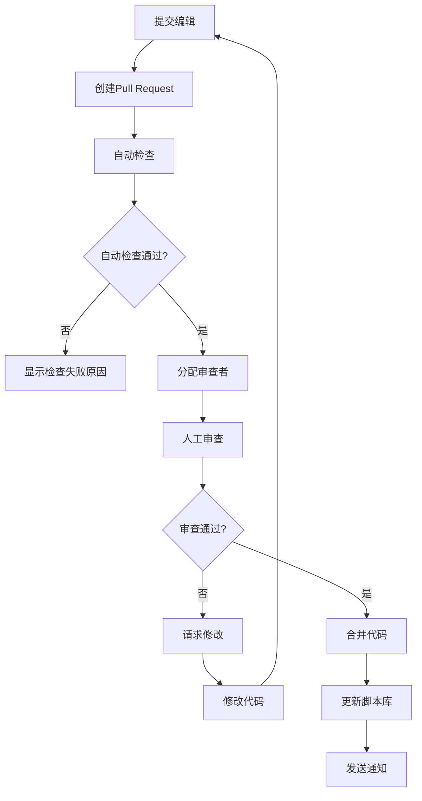

#### 5.3.6 代码审查配置

```json
{
  "code_review_config": {
    "auto_checks": {
      "syntax_check": true,
      "linting": true,
      "unit_tests": true,
      "security_scan": true,
      "complexity_check": true
    },
    "review_rules": {
      "min_reviewers": 1,
      "require_senior_review": false,
      "allow_self_approval": false,
      "block_on_changes": true
    },
    "approval_criteria": {
      "all_checks_pass": true,
      "at_least_one_approval": true,
      "no_blocking_comments": true,
      "max_review_time": "48h"
    },
    "notification": {
      "on_pr_created": ["reviewers"],
      "on_pr_approved": ["author"],
      "on_pr_merged": ["team"],
      "channels": ["lark", "email"]
    }
  }
}
```

#### 5.3.7 脚本版本管理

```javascript
class ScriptVersionManager {
  constructor() {
    this.versions = new Map();
    this.currentVersion = null;
  }

  async saveVersion(scriptId, script, author, comment) {
    const version = {
      id: `${scriptId}-v${Date.now()}`,
      scriptId,
      content: script,
      author,
      comment,
      timestamp: new Date(),
      isAI: false,
      isManual: true
    };

    this.versions.set(version.id, version);
    this.currentVersion = version.id;

    await this.persistToDatabase(version);
    return version;
  }

  async getVersionHistory(scriptId) {
    const versions = Array.from(this.versions.values())
      .filter(v => v.scriptId === scriptId)
      .sort((a, b) => b.timestamp - a.timestamp);

    return versions.map(v => ({
      id: v.id,
      author: v.author,
      comment: v.comment,
      timestamp: v.timestamp,
      isAI: v.isAI,
      isManual: v.isManual
    }));
  }

  async compareVersions(versionId1, versionId2) {
    const v1 = this.versions.get(versionId1);
    const v2 = this.versions.get(versionId2);

    return {
      added: this.diff(v1.content, v2.content).added,
      removed: this.diff(v1.content, v2.content).removed,
      modified: this.diff(v1.content, v2.content).modified
    };
  }

  async rollback(scriptId, versionId) {
    const version = this.versions.get(versionId);
    if (!version || version.scriptId !== scriptId) {
      throw new Error('版本不存在');
    }

    await this.saveVersion(
      scriptId,
      version.content,
      'system',
      `回滚到版本 ${versionId}`
    );

    return version.content;
  }
}
```

#### 5.3.8 AI 辅助编辑

```javascript
class AIAssistedEditor {
  constructor(aiModel) {
    this.aiModel = aiModel;
  }

  async suggestOptimizations(script, framework) {
    const prompt = `
你是一个专业的测试开发工程师。请分析以下${framework}测试脚本，提供优化建议：

脚本内容：
${script}

请提供：
1. 代码质量改进建议
2. 性能优化建议
3. 最佳实践建议
4. 潜在问题识别

输出格式：JSON
`;

    const response = await this.aiModel.generate(prompt);
    return JSON.parse(response);
  }

  async fixErrors(script, errors) {
    const prompt = `
请修复以下测试脚本中的错误：

脚本内容：
${script}

错误信息：
${errors.map(e => `- ${e.message}`).join('\n')}

请输出修复后的完整脚本代码。
`;

    const response = await this.aiModel.generate(prompt);
    return response;
  }

  async generateTestCase(description, framework) {
    const prompt = `
请根据以下测试描述生成${framework}测试脚本：

测试描述：
${description}

要求：
1. 使用Page Object模式
2. 添加适当的等待和断言
3. 包含错误处理
4. 代码清晰易读

请输出完整的测试脚本代码。
`;

    const response = await this.aiModel.generate(prompt);
    return response;
  }
}
```

### 5.4 MCP集成支持

#### 5.3.1 MCP协议概述

MCP（Model Context Protocol）是一种用于AI助手与外部工具集成的协议，支持：
- 工具调用和参数传递
- 上下文管理和状态同步
- 资源访问和数据交换
- 提示词模板管理

#### 5.3.2 MCP测试架构

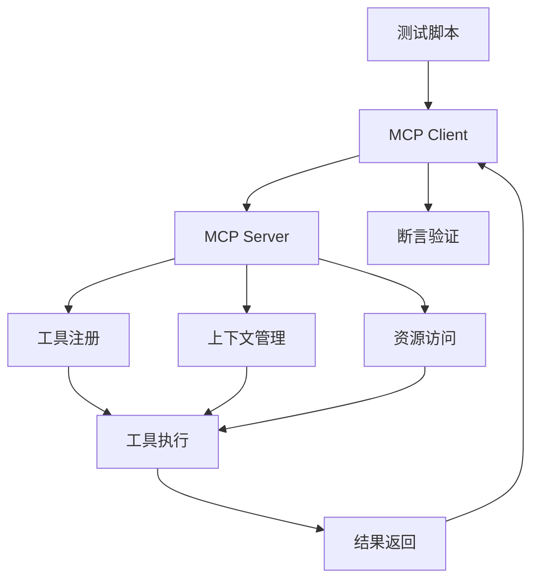

#### 5.3.3 MCP配置示例

```json
{
  "mcp_config": {
    "server": {
      "name": "test-mcp-server",
      "version": "1.0.0",
      "transport": "stdio"
    },
    "tools": [
      {
        "name": "auth-service",
        "description": "用户认证服务",
        "inputSchema": {
          "type": "object",
          "properties": {
            "action": {"type": "string", "enum": ["login", "logout", "register"]},
            "email": {"type": "string"},
            "password": {"type": "string"}
          },
          "required": ["action"]
        }
      },
      {
        "name": "user-profile",
        "description": "用户资料管理",
        "inputSchema": {
          "type": "object",
          "properties": {
            "action": {"type": "string", "enum": ["get", "update"]},
            "user_id": {"type": "string"},
            "profile_data": {"type": "object"}
          },
          "required": ["action", "user_id"]
        }
      }
    ],
    "resources": [
      {
        "uri": "config://test-environment",
        "name": "测试环境配置",
        "description": "获取测试环境配置信息"
      }
    ]
  }
}
```

#### 5.3.4 MCP测试脚本示例

```javascript
const { test, expect } = require('@playwright/test');
const { MCPClient } = require('@mcp/client');

test.describe('MCP集成测试', () => {
  let mcpClient;

  test.beforeAll(async () => {
    mcpClient = new MCPClient({
      serverName: 'test-mcp-server',
      transport: 'stdio'
    });
    await mcpClient.connect();
  });

  test.afterAll(async () => {
    await mcpClient.disconnect();
  });

  test('TC-MCP-001: 通过MCP调用登录服务', async ({ page }) => {
    await page.goto('https://admin.example.com/login');

    const loginResult = await mcpClient.callTool('auth-service', {
      action: 'login',
      email: 'test@example.com',
      password: '123456'
    });

    expect(loginResult.success).toBe(true);
    expect(loginResult.token).toBeDefined();
    expect(loginResult.user_id).toBeDefined();

    await page.fill('input#email', 'test@example.com');
    await page.fill('input#password', '123456');
    await page.click('button.login-btn');

    await expect(page).toHaveURL('https://admin.example.com/dashboard');
  });

  test('TC-MCP-002: MCP上下文传递测试', async ({ page }) => {
    const context = await mcpClient.getContext();
    expect(context.user_id).toBeDefined();
    expect(context.session_token).toBeDefined();

    const profile = await mcpClient.callTool('user-profile', {
      action: 'get',
      user_id: context.user_id
    });

    expect(profile.email).toBe('test@example.com');
  });
});
```

### 5.4 脚本生成流程

#### 5.4.1 模板匹配

```json
{
  "templates": {
    "playwright": {
      "login": {
        "template": "test('{case_title}', async ({ page }) => {\n  await page.goto('{url}');\n  await page.fill('{email_selector}', '{email}');\n  await page.fill('{password_selector}', '{password}');\n  await page.click('{submit_selector}');\n  await expect(page).toHaveURL('{expected_url}');\n});",
        "parameters": ["case_title", "url", "email_selector", "email", "password_selector", "password", "submit_selector", "expected_url"]
      }
    },
    "mcp": {
      "tool_call": {
        "template": "const result = await mcpClient.callTool('{tool_name}', {params});\nexpect(result.success).toBe(true);",
        "parameters": ["tool_name", "params"]
      }
    }
  }
}
```

#### 5.4.2 AI代码生成提示词

```
你是一个专业的测试开发工程师，擅长生成高质量的自动化测试脚本。

要求：
1. 根据测试用例生成可执行的{FRAMEWORK}脚本
2. 使用最佳实践和设计模式
3. 添加适当的注释
4. 确保代码可维护性和可扩展性
5. 输出纯代码，不包含解释文字
6. 如果用例包含MCP配置，需要生成MCP集成代码
7. 对于E2E测试，需要使用Page Object模式
8. 对于冒烟测试，需要快速执行和清晰报告

测试用例：
{TEST_CASE_JSON}

技术约束：
- 使用Page Object模式
- 代码风格遵循PEP8（Python）/ESLint（JS）
- 添加必要的等待和异常处理
- MCP集成需要使用@mcp/client库
- E2E测试需要使用数据驱动模式

请输出完整的测试脚本代码。
```

### 5.5 生成的脚本示例

**Playwright示例：**
```javascript
const { test, expect } = require('@playwright/test');

test.describe('用户登录模块测试', () => {
  test('TC-LOGIN-001: 正常登录-邮箱密码正确', async ({ page }) => {
    await page.goto('https://admin.example.com/login');
    
    await page.fill('input#email', 'test@example.com');
    await page.fill('input#password', '123456');
    await page.click('button.login-btn');
    
    await expect(page).toHaveURL('https://admin.example.com/dashboard');
    await expect(page.locator('span.username')).toContainText('test@example.com');
  });

  test('TC-LOGIN-002: 登录失败-密码错误', async ({ page }) => {
    await page.goto('https://admin.example.com/login');
    
    await page.fill('input#email', 'test@example.com');
    await page.fill('input#password', 'wrongpassword');
    await page.click('button.login-btn');
    
    await expect(page.locator('.error-message')).toContainText('密码错误');
  });
});
```

**E2E测试示例：**
```javascript
const { test, expect } = require('@playwright/test');

test.describe('电商E2E测试', () => {
  test('TC-E2E-001: 用户注册到下单完整流程', async ({ page }) => {
    await page.goto('https://shop.example.com');
    
    await page.click('button.register');
    await page.fill('input#email', `test${Date.now()}@example.com`);
    await page.fill('input#password', 'Test123456');
    await page.click('button.submit-register');
    
    await expect(page).toHaveURL('https://shop.example.com/home');
    
    await page.click('nav.products');
    await expect(page.locator('.product-list')).toBeVisible();
    
    await page.click('.product-item:first-child button.add-to-cart');
    await expect(page.locator('.cart-count')).toHaveText('1');
    
    await page.click('nav.cart');
    await page.click('button.checkout');
    
    await expect(page.locator('.checkout-form')).toBeVisible();
    await page.fill('input#address', '测试地址');
    await page.click('button.place-order');
    
    await expect(page.locator('.order-success')).toBeVisible();
    await expect(page.locator('.order-id')).toContainText('ORD-');
  });
});
```

**REST Assured示例：**
```java
import io.restassured.RestAssured;
import static io.restassured.RestAssured.*;
import static org.hamcrest.Matchers.*;

public class LoginApiTest {
    
    @Test
    public void testSuccessfulLogin() {
        given()
            .contentType("application/json")
            .body("{\"email\": \"test@example.com\", \"password\": \"123456\"}")
        .when()
            .post("/api/login")
        .then()
            .statusCode(200)
            .body("success", is(true))
            .body("token", notNullValue());
    }
    
    @Test
    public void testFailedLoginWithWrongPassword() {
        given()
            .contentType("application/json")
            .body("{\"email\": \"test@example.com\", \"password\": \"wrong\"}")
        .when()
            .post("/api/login")
        .then()
            .statusCode(401)
            .body("success", is(false))
            .body("message", equalTo("邮箱或密码错误"));
    }
}
```

---

## 六、测试编排引擎

### 6.1 编排架构

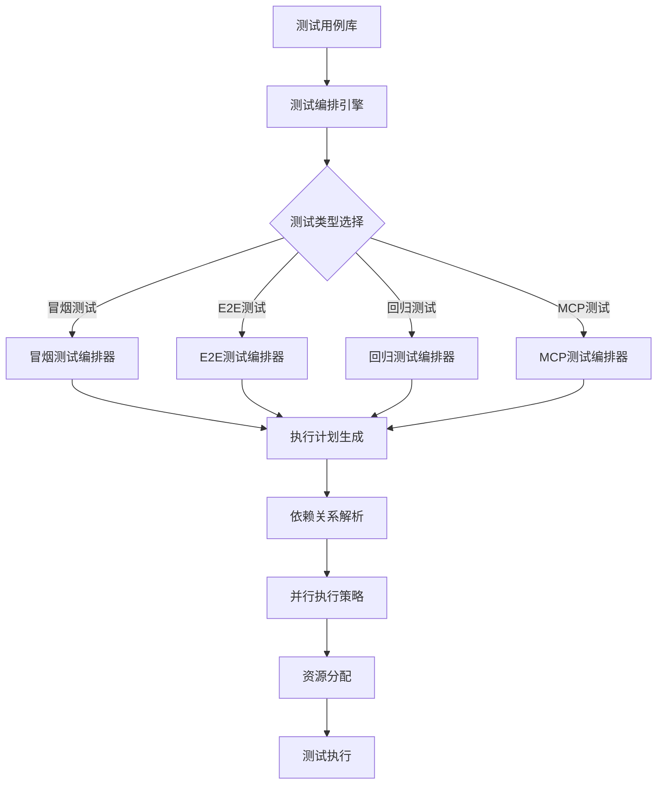

### 6.2 冒烟测试编排

#### 6.2.1 冒烟测试策略

| 策略 | 描述 | 执行时间 |
|-----|------|---------|
| **快速冒烟** | 只执行核心功能，快速验证系统可用性 | 5-10分钟 |
| **标准冒烟** | 执行所有P0级别用例，覆盖主要功能 | 15-30分钟 |
| **完整冒烟** | 执行P0+P1用例，确保系统基本稳定 | 30-60分钟 |

#### 6.2.2 冒烟测试编排配置

```json
{
  "smoke_test_config": {
    "name": "快速冒烟测试",
    "strategy": "fast",
    "max_duration": "10m",
    "parallel_execution": true,
    "max_parallel": 5,
    "test_selection": {
      "priority": ["P0"],
      "tags": ["smoke", "critical"],
      "exclude_tags": ["slow", "manual"]
    },
    "execution_order": [
      "用户登录",
      "核心页面加载",
      "API健康检查",
      "数据库连接"
    ],
    "failure_handling": {
      "stop_on_failure": true,
      "max_failures": 3,
      "continue_on_warning": true
    },
    "notification": {
      "on_success": ["team@company.com"],
      "on_failure": ["team@company.com", "devops@company.com"]
    }
  }
}
```

#### 6.2.3 冒烟测试脚本示例

```javascript
const { test, expect } = require('@playwright/test');

test.describe('冒烟测试套件', () => {
  test('SMOKE-001: 系统健康检查', async ({ request }) => {
    const response = await request.get('/api/health');
    expect(response.status()).toBe(200);
    const data = await response.json();
    expect(data.status).toBe('ok');
  });

  test('SMOKE-002: 用户登录功能', async ({ page }) => {
    await page.goto('https://admin.example.com/login');
    await page.fill('input#email', 'test@example.com');
    await page.fill('input#password', '123456');
    await page.click('button.login-btn');
    await expect(page).toHaveURL('https://admin.example.com/dashboard');
  });

  test('SMOKE-003: 核心页面加载', async ({ page }) => {
    const pages = [
      '/dashboard',
      '/products',
      '/orders',
      '/settings'
    ];
    
    for (const pagePath of pages) {
      await page.goto(`https://admin.example.com${pagePath}`);
      await expect(page.locator('body')).toBeVisible();
    }
  });

  test('SMOKE-004: MCP服务连接', async ({ mcpClient }) => {
    const result = await mcpClient.callTool('health-check', {});
    expect(result.status).toBe('healthy');
  });
});
```

### 6.3 E2E测试编排

#### 6.3.1 E2E测试流程设计

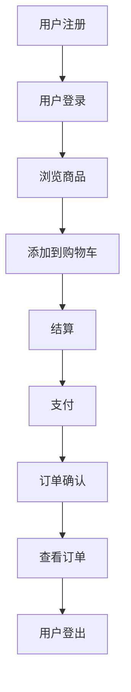

#### 6.3.2 E2E测试编排配置

```json
{
  "e2e_test_config": {
    "name": "电商全流程E2E测试",
    "max_duration": "30m",
    "parallel_execution": false,
    "test_scenarios": [
      {
        "scenario_id": "E2E-001",
        "name": "新用户完整购物流程",
        "steps": [
          {"test_id": "TC-REGISTER-001", "name": "用户注册"},
          {"test_id": "TC-LOGIN-001", "name": "用户登录"},
          {"test_id": "TC-BROWSE-001", "name": "浏览商品"},
          {"test_id": "TC-CART-001", "name": "添加到购物车"},
          {"test_id": "TC-CHECKOUT-001", "name": "结算"},
          {"test_id": "TC-PAYMENT-001", "name": "支付"},
          {"test_id": "TC-ORDER-001", "name": "订单确认"}
        ],
        "data_driven": true,
        "test_data": [
          {
            "user_type": "normal",
            "payment_method": "credit_card"
          },
          {
            "user_type": "vip",
            "payment_method": "alipay"
          }
        ]
      }
    ],
    "cleanup": {
      "enabled": true,
      "steps": ["delete_test_user", "cancel_test_orders"]
    }
  }
}
```

#### 6.3.3 E2E测试脚本示例

```javascript
const { test, expect } = require('@playwright/test');

test.describe('E2E全流程测试', () => {
  test('E2E-001: 新用户完整购物流程', async ({ page, context }) => {
    const timestamp = Date.now();
    const testEmail = `test${timestamp}@example.com`;

    await test.step('用户注册', async () => {
      await page.goto('https://shop.example.com/register');
      await page.fill('input#email', testEmail);
      await page.fill('input#password', 'Test123456');
      await page.fill('input#confirm-password', 'Test123456');
      await page.click('button.register');
      
      await expect(page).toHaveURL('https://shop.example.com/home');
    });

    await test.step('浏览商品', async () => {
      await page.click('nav.products');
      await expect(page.locator('.product-list')).toBeVisible();
      
      await page.click('.product-item:first-child');
      await expect(page.locator('.product-detail')).toBeVisible();
    });

    await test.step('添加到购物车', async () => {
      await page.click('button.add-to-cart');
      await expect(page.locator('.toast-success')).toContainText('已添加到购物车');
      
      await page.click('nav.cart');
      await expect(page.locator('.cart-items')).toHaveCount(1);
    });

    await test.step('结算', async () => {
      await page.click('button.checkout');
      await expect(page.locator('.checkout-form')).toBeVisible();
      
      await page.fill('input#address', '测试地址123');
      await page.fill('input#phone', '13800138000');
      await page.click('button.place-order');
    });

    await test.step('支付', async () => {
      await expect(page.locator('.payment-methods')).toBeVisible();
      await page.click('.payment-method:first-child');
      await page.click('button.confirm-payment');
      
      await expect(page.locator('.payment-success')).toBeVisible();
    });

    await test.step('订单确认', async () => {
      await expect(page.locator('.order-confirmation')).toBeVisible();
      const orderId = await page.locator('.order-id').textContent();
      expect(orderId).toMatch(/^ORD-\d+$/);
    });

    await test.step('查看订单', async () => {
      await page.click('nav.orders');
      await expect(page.locator('.order-list')).toBeVisible();
      await expect(page.locator('.order-item:first-child')).toBeVisible();
    });

    await test.step('用户登出', async () => {
      await page.click('nav.user-menu');
      await page.click('button.logout');
      await expect(page).toHaveURL('https://shop.example.com/login');
    });
  });
});
```

### 6.4 回归测试编排

#### 6.4.1 回归测试策略

| 策略 | 描述 | 执行频率 |
|-----|------|---------|
| **增量回归** | 只执行受影响模块的测试用例 | 每次代码提交 |
| **全量回归** | 执行所有回归测试用例 | 每日/每周 |
| **选择性回归** | 基于代码变更分析选择测试用例 | 每次代码提交 |

#### 6.4.2 回归测试编排配置

```json
{
  "regression_test_config": {
    "name": "全量回归测试",
    "strategy": "full",
    "max_duration": "2h",
    "parallel_execution": true,
    "max_parallel": 10,
    "test_selection": {
      "tags": ["regression"],
      "include_related_bugs": true,
      "bug_age_limit": "30d"
    },
    "test_groups": [
      {
        "group_name": "用户模块回归",
        "test_ids": ["TC-USER-001", "TC-USER-002", "TC-USER-003"],
        "priority": "P0",
        "parallel": true
      },
      {
        "group_name": "订单模块回归",
        "test_ids": ["TC-ORDER-001", "TC-ORDER-002", "TC-ORDER-003"],
        "priority": "P0",
        "parallel": true
      },
      {
        "group_name": "支付模块回归",
        "test_ids": ["TC-PAYMENT-001", "TC-PAYMENT-002"],
        "priority": "P1",
        "parallel": false
      }
    ],
    "bug_tracking": {
      "enabled": true,
      "jira_integration": true,
      "auto_create_bug": false,
      "bug_template": {
        "project": "TEST",
        "issue_type": "Bug",
        "priority": "High",
        "labels": ["regression", "automated"]
      }
    },
    "trend_analysis": {
      "enabled": true,
      "compare_with": "last_run",
      "alert_on_regression": true
    }
  }
}
```

#### 6.4.3 回归测试脚本示例

```javascript
const { test, expect } = require('@playwright/test');

test.describe('回归测试套件', () => {
  test.describe('用户模块回归', () => {
    test('REG-USER-001: 验证缺陷#1234修复', async ({ page }) => {
      await page.goto('https://admin.example.com/users');
      await page.click('button.add-user');
      await page.fill('input#email', 'test@example.com');
      await page.click('button.save');
      
      await expect(page.locator('.error-message')).not.toBeVisible();
      await expect(page.locator('.success-message')).toContainText('用户创建成功');
    });

    test('REG-USER-002: 验证缺陷#1235修复', async ({ page }) => {
      await page.goto('https://admin.example.com/users/test@example.com');
      await page.fill('input#email', 'newemail@example.com');
      await page.click('button.save');
      
      await expect(page.locator('.user-email')).toHaveText('newemail@example.com');
    });
  });

  test.describe('订单模块回归', () => {
    test('REG-ORDER-001: 验证缺陷#1236修复', async ({ page }) => {
      await page.goto('https://shop.example.com/orders');
      await page.click('.order-item:first-child');
      
      await expect(page.locator('.order-detail')).toBeVisible();
      await expect(page.locator('.order-total')).not.toContainText('NaN');
    });
  });
});
```

### 6.5 测试执行引擎

#### 6.5.1 执行引擎架构

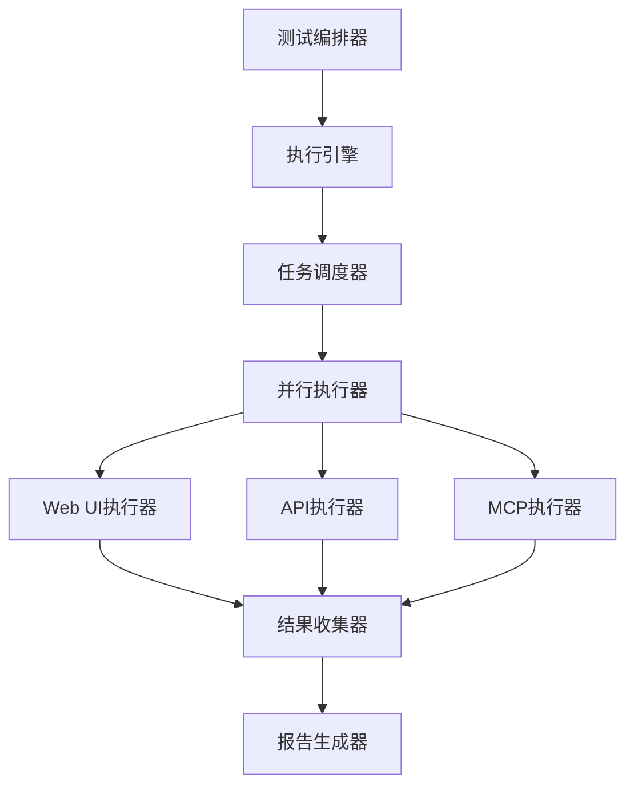

#### 6.5.2 执行引擎配置

```json
{
  "execution_engine_config": {
    "scheduler": {
      "type": "priority_queue",
      "max_concurrent": 10,
      "timeout": "30m",
      "retry_policy": {
        "max_retries": 2,
        "retry_delay": "5s",
        "retry_on": ["timeout", "network_error"]
      }
    },
    "executors": {
      "web_ui": {
        "type": "playwright",
        "browsers": ["chromium", "firefox", "webkit"],
        "headless": true,
        "screenshot_on_failure": true,
        "video_recording": true
      },
      "api": {
        "type": "rest-assured",
        "base_url": "https://api.example.com",
        "timeout": "10s"
      },
      "mcp": {
        "type": "mcp-client",
        "servers": ["auth-service", "user-service", "order-service"],
        "timeout": "15s"
      }
    },
    "reporting": {
      "format": ["json", "html", "junit"],
      "allure_integration": true,
      "real_time_updates": true
    }
  }
}
```

---

## 七、集成与执行流程

### 7.1 CI/CD集成点

| 阶段 | 集成内容 | 工具 |
|-----|---------|------|
| **代码提交** | BSD变更触发解析 | Git Hooks |
| **构建阶段** | 脚本编译/语法检查 | Maven/Gradle |
| **冒烟测试** | 快速验证系统可用性 | Jenkins/GitHub Actions |
| **E2E测试** | 完整业务流程验证 | Jenkins/GitHub Actions |
| **回归测试** | 历史缺陷验证 | Jenkins/GitHub Actions |
| **报告阶段** | 测试结果收集分析 | Allure/JUnit |
| **部署阶段** | 测试环境部署 | Docker/Kubernetes |

### 7.2 完整数据流

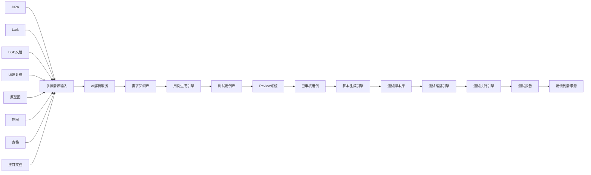

### 7.3 GitLab CI/CD Pipeline 示例

```yaml
# .gitlab-ci.yml

stages:
  - parse
  - generate
  - smoke
  - e2e
  - regression
  - report

variables:
  NODE_VERSION: "18"
  PYTHON_VERSION: "3.11"
  PIP_CACHE_DIR: "$CI_PROJECT_DIR/.pip-cache"

cache:
  paths:
    - .pip-cache/
    - node_modules/
    - .npm/

# 多源需求解析
parse_requirements:
  stage: parse
  image: python:${PYTHON_VERSION}
  parallel:
    matrix:
      - SOURCE_TYPE: ["BSD", "JIRA", "Lark", "Figma", "Axure", "Modao", "Excel", "Screenshot"]
  script:
    - pip install -r requirements.txt
    - |
      case $SOURCE_TYPE in
        "BSD")
          python scripts/parse_bsd.py --input sources/BSD/ --output parsed/BSD/
          ;;
        "JIRA")
          python scripts/parse_jira.py --project $JIRA_PROJECT --sprint $JIRA_SPRINT --output parsed/JIRA/
          ;;
        "Lark")
          python scripts/parse_lark.py --folder-token $LARK_FOLDER_TOKEN --output parsed/Lark/
          ;;
        "Figma")
          python scripts/parse_figma.py --file-key $FIGMA_FILE_KEY --output parsed/Figma/
          ;;
        "Axure")
          python scripts/parse_axure.py --url $AXURE_URL --output parsed/Axure/
          ;;
        "Modao")
          python scripts/parse_modao.py --url $MODAO_URL --output parsed/Modao/
          ;;
        "Excel")
          python scripts/parse_excel.py --input sources/requirements.xlsx --output parsed/Excel/
          ;;
        "Screenshot")
          python scripts/parse_screenshot.py --input sources/screenshots/ --output parsed/Screenshots/
          ;;
      esac
  artifacts:
    paths:
      - parsed/$SOURCE_TYPE/
    expire_in: 1 hour
  rules:
    - if: $CI_PIPELINE_SOURCE == "merge_request_event"
    - if: $CI_COMMIT_BRANCH == "main"

# 用例生成
generate_test_cases:
  stage: generate
  image: python:${PYTHON_VERSION}
  script:
    - pip install -r requirements.txt
    - python scripts/generate_test_cases.py --input parsed/requirements.json --output test_cases/
  artifacts:
    paths:
      - test_cases/
    expire_in: 1 hour
  dependencies:
    - parse_requirements
  rules:
    - if: $CI_PIPELINE_SOURCE == "merge_request_event"
    - if: $CI_COMMIT_BRANCH == "main"

# 脚本生成
generate_scripts:
  stage: generate
  image: node:${NODE_VERSION}
  script:
    - npm ci
    - npm run generate:scripts
  artifacts:
    paths:
      - scripts/
    expire_in: 1 hour
  dependencies:
    - generate_test_cases
  rules:
    - if: $CI_PIPELINE_SOURCE == "merge_request_event"
    - if: $CI_COMMIT_BRANCH == "main"

# 冒烟测试
smoke_test:
  stage: smoke
  image: mcr.microsoft.com/playwright:v1.40.0
  script:
    - npm ci
    - npm run test:smoke -- --reporter=html --reporter=junit
  artifacts:
    when: always
    paths:
      - reports/smoke/
      - playwright-report/
      - test-results/
    reports:
      junit: reports/smoke/junit.xml
    expire_in: 1 week
  coverage: '/Lines\s*:\s*(\d+\.\d+)%/'
  rules:
    - if: $CI_PIPELINE_SOURCE == "merge_request_event"
    - if: $CI_COMMIT_BRANCH == "main"

# E2E 测试
e2e_test:
  stage: e2e
  image: mcr.microsoft.com/playwright:v1.40.0
  script:
    - npm ci
    - npm run test:e2e -- --reporter=html --reporter=junit
  artifacts:
    when: always
    paths:
      - reports/e2e/
      - playwright-report/
      - test-results/
    reports:
      junit: reports/e2e/junit.xml
    expire_in: 1 week
  rules:
    - if: $CI_COMMIT_BRANCH == "main"
      when: on_success
    - if: $CI_COMMIT_TAG
      when: manual

# 回归测试
regression_test:
  stage: regression
  image: mcr.microsoft.com/playwright:v1.40.0
  parallel:
    matrix:
      - TEST_GROUP: ["user", "order", "payment"]
  script:
    - npm ci
    - npm run test:regression -- --group=${TEST_GROUP} --reporter=html --reporter=junit
  artifacts:
    when: always
    paths:
      - reports/regression/
      - playwright-report/
      - test-results/
    reports:
      junit: reports/regression/junit.xml
    expire_in: 1 week
  rules:
    - if: $CI_COMMIT_BRANCH == "main"
      when: on_success
    - if: $CI_COMMIT_TAG
      when: manual

# 测试报告
test_report:
  stage: report
  image: node:${NODE_VERSION}
  script:
    - npm ci
    - npm run generate:report
  artifacts:
    paths:
      - reports/summary/
    expire_in: 30 days
  dependencies:
    - smoke_test
    - e2e_test
    - regression_test
  rules:
    - if: $CI_COMMIT_BRANCH == "main"
      when: always

# MCP 测试
mcp_test:
  stage: smoke
  image: node:${NODE_VERSION}
  services:
    - docker:dind
  script:
    - npm ci
    - npm run test:mcp -- --reporter=html --reporter=junit
  artifacts:
    when: always
    paths:
      - reports/mcp/
    reports:
      junit: reports/mcp/junit.xml
    expire_in: 1 week
  variables:
    MCP_SERVER_URL: "http://mcp-server:8080"
  rules:
    - if: $CI_PIPELINE_SOURCE == "merge_request_event"
    - if: $CI_COMMIT_BRANCH == "main"

# 自动修复
auto_repair:
  stage: regression
  image: node:${NODE_VERSION}
  script:
    - npm ci
    - npm run test:auto-repair -- --failed-tests=test-results/
  artifacts:
    paths:
      - scripts/repaired/
    expire_in: 1 week
  when: on_failure
  dependencies:
    - smoke_test
    - e2e_test
  rules:
    - if: $CI_COMMIT_BRANCH == "main"
      when: on_failure

# Allure 报告
allure_report:
  stage: report
  image: frankescobar/allure-docker-service:latest
  script:
    - allure generate --clean -o allure-report allure-results
  artifacts:
    paths:
      - allure-report/
    expire_in: 30 days
  dependencies:
    - smoke_test
    - e2e_test
    - regression_test
  rules:
    - if: $CI_COMMIT_BRANCH == "main"
      when: always
```

### 7.4 GitLab CI/CD 高级配置

#### 7.4.1 并行执行配置

```yaml
# 并行测试执行
parallel_tests:
  stage: smoke
  image: mcr.microsoft.com/playwright:v1.40.0
  parallel: 5
  script:
    - npm ci
    - npm run test:smoke -- --shard=$CI_NODE_INDEX/$CI_NODE_TOTAL
  artifacts:
    when: always
    paths:
      - test-results/
    expire_in: 1 week
```

#### 7.4.2 定时触发配置

```yaml
# 定时触发器 (在 GitLab UI 中配置)
# Settings -> CI/CD -> Schedules
# 每天凌晨 2 点执行完整回归测试
scheduled_regression:
  stage: regression
  image: mcr.microsoft.com/playwright:v1.40.0
  script:
    - npm ci
    - npm run test:regression:full
  rules:
    - if: $CI_PIPELINE_SOURCE == "schedule"
      when: always
```

#### 7.4.3 手动触发配置

```yaml
# 手动触发 E2E 测试
manual_e2e:
  stage: e2e
  image: mcr.microsoft.com/playwright:v1.40.0
  script:
    - npm ci
    - npm run test:e2e
  when: manual
  allow_failure: false
```

#### 7.4.4 环境变量配置

```yaml
# .gitlab-ci.yml 中的环境变量
variables:
  # AI 模型配置
  AI_MODEL_DEFAULT: "deepseek-v4-flash"
  AI_FALLBACK_MODELS: "gpt-4,claude-3,gemini-pro"
  
  # 测试配置
  TEST_TIMEOUT: "30000"
  TEST_RETRY_COUNT: "3"
  
  # MCP 配置
  MCP_ENABLED: "true"
  MCP_SERVER_URL: "http://mcp-server:8080"
  
  # 报告配置
  ALLURE_ENABLED: "true"
  REPORT_FORMAT: "html,junit,json"
  
  # 自动修复配置
  AUTO_REPAIR_ENABLED: "true"
  AUTO_REPAIR_THRESHOLD: "0.7"
```

#### 7.4.5 GitLab Pages 报告部署

```yaml
# 部署测试报告到 GitLab Pages
pages:
  stage: report
  image: node:${NODE_VERSION}
  script:
    - mkdir -p public/reports
    - cp -r reports/smoke public/reports/smoke
    - cp -r reports/e2e public/reports/e2e
    - cp -r reports/regression public/reports/regression
    - cp -r allure-report public/allure
  artifacts:
    paths:
      - public
    expire_in: 30 days
  rules:
    - if: $CI_COMMIT_BRANCH == "main"
```

#### 7.4.6 Lark 通知配置

```yaml
# .gitlab-ci.yml
default:
  notifications:
    on_failure: always
    on_success: change

# Lark 机器人通知
notify_lark:
  stage: .post
  image: curlimages/curl:latest
  script:
    - |
      if [ "$CI_JOB_STATUS" == "failed" ]; then
        curl -X POST -H 'Content-type: application/json' \
          --data "{
            \"msg_type\": \"interactive\",
            \"card\": {
              \"config\": {\"wide_screen_mode\": true},
              \"header\": {
                \"title\": {\"tag\": \"plain_text\", \"content\": \"❌ 测试执行失败\"},
                \"template\": \"red\"
              },
              \"elements\": [
                {
                  \"tag\": \"div\",
                  \"text\": {
                    \"tag\": \"lark_md\",
                    \"content\": \"**项目：** ${CI_PROJECT_NAME}\n**分支：** ${CI_COMMIT_BRANCH}\n**提交：** ${CI_COMMIT_SHORT_SHA}\n**流水线：** ${CI_PIPELINE_URL}\n**失败 Job：** ${CI_JOB_NAME}\n**执行人：** ${GITLAB_USER_NAME}\"
                  }
                },
                {
                  \"tag\": \"action\",
                  \"actions\": [
                    {
                      \"tag\": \"button\",
                      \"text\": {\"tag\": \"plain_text\", \"content\": \"查看详情\"},
                      \"url\": \"${CI_PIPELINE_URL}\",
                      \"type\": \"primary\"
                    }
                  ]
                }
              ]
            }
          }" \
          $LARK_WEBHOOK_URL
      else
        curl -X POST -H 'Content-type: application/json' \
          --data "{
            \"msg_type\": \"interactive\",
            \"card\": {
              \"config\": {\"wide_screen_mode\": true},
              \"header\": {
                \"title\": {\"tag\": \"plain_text\", \"content\": \"✅ 测试执行成功\"},
                \"template\": \"green\"
              },
              \"elements\": [
                {
                  \"tag\": \"div\",
                  \"text\": {
                    \"tag\": \"lark_md\",
                    \"content\": \"**项目：** ${CI_PROJECT_NAME}\n**分支：** ${CI_COMMIT_BRANCH}\n**提交：** ${CI_COMMIT_SHORT_SHA}\n**流水线：** ${CI_PIPELINE_URL}\n**执行人：** ${GITLAB_USER_NAME}\"
                  }
                }
              ]
            }
          }" \
          $LARK_WEBHOOK_URL
      fi
  when: always
  variables:
    LARK_WEBHOOK_URL: $LARK_WEBHOOK_URL
```

#### 7.4.7 高级 Lark 通知（带测试报告）

```yaml
# Lark 详细测试报告通知
notify_lark_detailed:
  stage: .post
  image: node:18
  script:
    - npm install -g @larksuite/cli
    - |
      # 生成测试摘要
      PASSED=$(cat reports/summary.json | jq -r '.summary.passed // 0')
      FAILED=$(cat reports/summary.json | jq -r '.summary.failed // 0')
      SKIPPED=$(cat reports/summary.json | jq -r '.summary.skipped // 0')
      TOTAL=$((PASSED + FAILED + SKIPPED))
      PASS_RATE=$(awk "BEGIN {printf \"%.1f\", ($PASSED/$TOTAL)*100}")
      
      # 发送 Lark 卡片消息
      curl -X POST -H 'Content-type: application/json' \
        --data "{
          \"msg_type\": \"interactive\",
          \"card\": {
            \"config\": {\"wide_screen_mode\": true},
            \"header\": {
              \"title\": {\"tag\": \"plain_text\", \"content\": \"🧪 测试执行报告\"},
              \"template\": \"blue\"
            },
            \"elements\": [
              {
                \"tag\": \"div\",
                \"text\": {
                  \"tag\": \"lark_md\",
                  \"content\": \"**项目：** ${CI_PROJECT_NAME}\n**分支：** ${CI_COMMIT_BRANCH}\n**提交：** ${CI_COMMIT_MESSAGE}\n**执行人：** ${GITLAB_USER_NAME}\"
                }
              },
              {
                \"tag\": \"hr\"
              },
              {
                \"tag\": \"div\",
                \"text\": {
                  \"tag\": \"lark_md\",
                  \"content\": \"📊 **测试结果摘要**\n\n✅ 通过：${PASSED}\n❌ 失败：${FAILED}\n⏭️ 跳过：${SKIPPED}\n📈 通过率：${PASS_RATE}%\"
                }
              },
              {
                \"tag\": \"action\",
                \"actions\": [
                  {
                    \"tag\": \"button\",
                    \"text\": {\"tag\": \"plain_text\", \"content\": \"查看报告\"},
                    \"url\": \"https://${CI_PROJECT_NAMESPACE}.gitlab.io/${CI_PROJECT_NAME}/reports/\",
                    \"type\": \"primary\"
                  },
                  {
                    \"tag\": \"button\",
                    \"text\": {\"tag\": \"plain_text\", \"content\": \"查看流水线\"},
                    \"url\": \"${CI_PIPELINE_URL}\",
                    \"type\": \"default\"
                  }
                ]
              }
            ]
          }
        }" \
        $LARK_WEBHOOK_URL
  when: always
  dependencies:
    - test_report
```

---

## 八、关键技术要点

### 8.1 AI模型选择建议

| 场景 | 推荐模型 | 理由 |
|-----|---------|------|
| 需求解析 | GPT-4/Claude 3 | 强语义理解能力 |
| 用例生成 | GPT-4o | 代码生成能力强 |
| 代码审查 | CodeLlama | 代码理解能力强 |
| 文档总结 | Gemini | 多模态理解 |
| MCP集成 | GPT-4 | 工具调用能力强 |

### 8.2 提示词工程最佳实践

1. **明确角色定位**：告诉AI它是测试专家
2. **结构化输出**：指定输出格式（JSON/XML）
3. **提供示例**：给出期望的输出样例
4. **迭代优化**：根据输出不断调整提示词
5. **上下文管理**：保持对话历史连贯性
6. **MCP工具描述**：清晰描述MCP工具的功能和参数

### 8.3 质量保障措施

| 措施 | 描述 |
|-----|------|
| **人工Review** | 关键用例必须经过人工审核 |
| **回归测试** | 确保修改不影响现有功能 |
| **代码审查** | 生成的脚本需要代码审查 |
| **持续监控** | 监控AI生成质量指标 |
| **MCP验证** | 验证MCP工具调用的正确性 |
| **冒烟测试** | 每次部署前执行快速验证 |
| **E2E测试** | 定期执行完整业务流程验证 |

---

## 九、测试报告与分析

### 9.1 报告类型

| 报告类型 | 内容 | 用途 |
|---------|------|------|
| **冒烟测试报告** | 核心功能验证结果 | 快速判断系统可用性 |
| **E2E测试报告** | 完整业务流程验证 | 端到端质量评估 |
| **回归测试报告** | 历史缺陷验证结果 | 质量趋势分析 |
| **MCP测试报告** | MCP集成测试结果 | 集成质量评估 |
| **综合测试报告** | 所有测试结果汇总 | 整体质量评估 |

### 9.2 报告示例

```json
{
  "report": {
    "test_run_id": "RUN-20240115-001",
    "timestamp": "2024-01-15T10:00:00",
    "duration": "45m30s",
    "summary": {
      "total_tests": 150,
      "passed": 142,
      "failed": 5,
      "skipped": 3,
      "pass_rate": "94.7%"
    },
    "by_category": {
      "smoke": {
        "total": 10,
        "passed": 10,
        "failed": 0,
        "pass_rate": "100%"
      },
      "e2e": {
        "total": 5,
        "passed": 4,
        "failed": 1,
        "pass_rate": "80%"
      },
      "regression": {
        "total": 100,
        "passed": 95,
        "failed": 4,
        "skipped": 1,
        "pass_rate": "95%"
      },
      "mcp": {
        "total": 35,
        "passed": 33,
        "failed": 0,
        "skipped": 2,
        "pass_rate": "100%"
      }
    },
    "failed_tests": [
      {
        "test_id": "TC-E2E-003",
        "title": "支付流程验证",
        "error": "Payment gateway timeout",
        "screenshot": "reports/screenshots/TC-E2E-003.png",
        "video": "reports/videos/TC-E2E-003.mp4"
      }
    ],
    "trend_analysis": {
      "compared_to_last_run": {
        "pass_rate_change": "+2.3%",
        "new_failures": 2,
        "fixed_failures": 3
      }
    }
  }
}
```

---

## 十、自动化脚本自我修复机制

### 10.1 自我修复架构

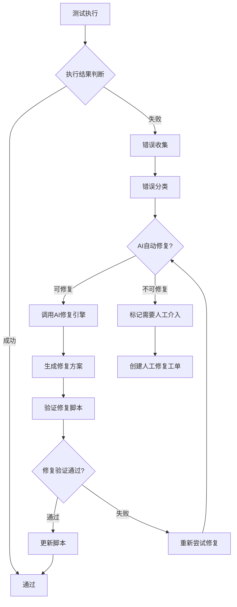

### 10.2 错误分类与修复策略

| 错误类型 | 描述 | 修复策略 | 示例 |
|---------|------|---------|------|
| **元素定位失败** | 页面元素找不到或已变更 | 智能重新定位 | CSS选择器、XPath、文本定位 |
| **超时错误** | 等待元素超时 | 调整等待策略 | 增加等待时间、智能等待 |
| **网络错误** | 网络请求失败 | 重试机制 | 请求重试、备用API |
| **断言失败** | 实际结果与预期不符 | 重新评估断言 | 更新断言条件 |
| **环境错误** | 环境配置问题 | 环境适配 | 配置调整、参数化 |
| **MCP错误** | MCP工具调用失败 | 工具重试/切换 | 备用工具、参数调整 |
| **未知错误** | 无法分类的错误 | 记录日志 | 人工介入 |

### 10.3 AI修复引擎

#### 10.3.1 修复引擎架构

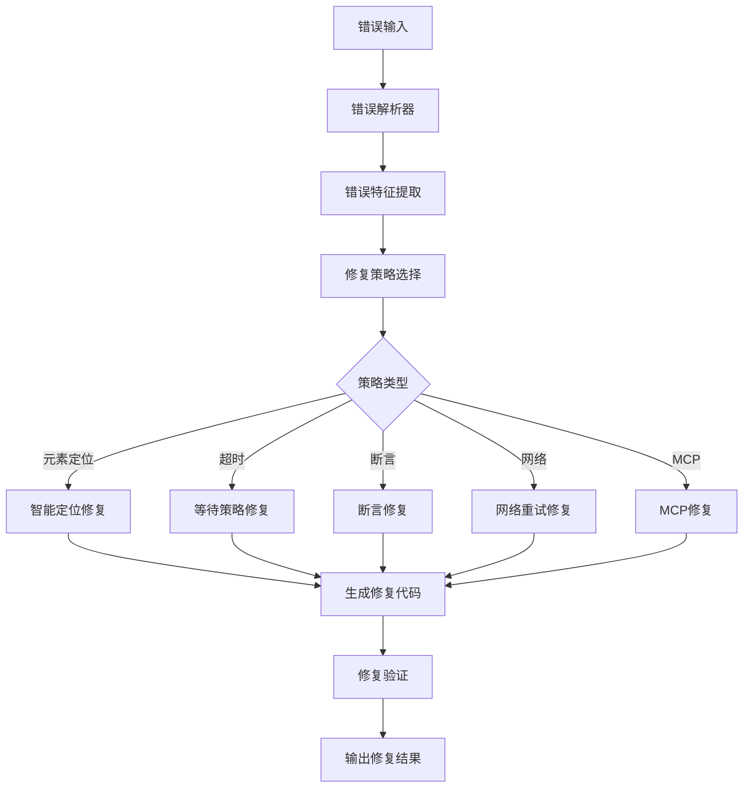

#### 10.3.2 AI修复提示词

```
你是一个专业的自动化测试工程师，擅长修复失败的测试脚本。

当前错误信息：
- 错误类型: {ERROR_TYPE}
- 错误消息: {ERROR_MESSAGE}
- 错误堆栈: {ERROR_STACK}
- 失败测试: {TEST_NAME}
- 错误截图: {SCREENSHOT_PATH}
- 视频记录: {VIDEO_PATH}

原始测试脚本：
{TEST_SCRIPT}

上下文信息：
- 测试框架: {FRAMEWORK}
- 页面URL: {PAGE_URL}
- 元素选择器: {SELECTORS_TRIED}
- 等待时间: {WAIT_TIME}
- MCP工具调用: {MCP_CALLS}

请根据以上信息：
1. 分析错误根本原因
2. 生成修复后的测试脚本
3. 解释修复方案
4. 如果无法修复，请说明原因

输出要求：
- JSON格式
- 包含修复后的脚本、修复说明、修复置信度
```

#### 10.3.3 修复配置示例

```json
{
  "auto_repair_config": {
    "enabled": true,
    "max_retry_attempts": 3,
    "retry_delay": "5s",
    "error_categories": {
      "element_not_found": {
        "auto_repair": true,
        "repair_strategies": [
          "smart_locator_regeneration",
          "xpath_optimization",
          "text_based_locator",
          "relative_locator"
        ]
      },
      "timeout": {
        "auto_repair": true,
        "repair_strategies": [
          "increase_wait_time",
          "smart_wait",
          "polling_optimization"
        ]
      },
      "assertion_failure": {
        "auto_repair": true,
        "repair_strategies": [
          "assertion_recalibration",
          "dynamic_assertion"
        ]
      },
      "network_error": {
        "auto_repair": true,
        "repair_strategies": [
          "request_retry",
          "fallback_api"
        ]
      },
      "mcp_error": {
        "auto_repair": true,
        "repair_strategies": [
          "tool_retry",
          "parameter_adjustment",
          "alternative_tool"
        ]
      }
    },
    "confidence_threshold": 0.7,
    "require_human_approval": false,
    "log_all_repair_attempts": true
  }
}
```

### 10.4 智能元素定位修复

#### 10.4.1 定位策略层级

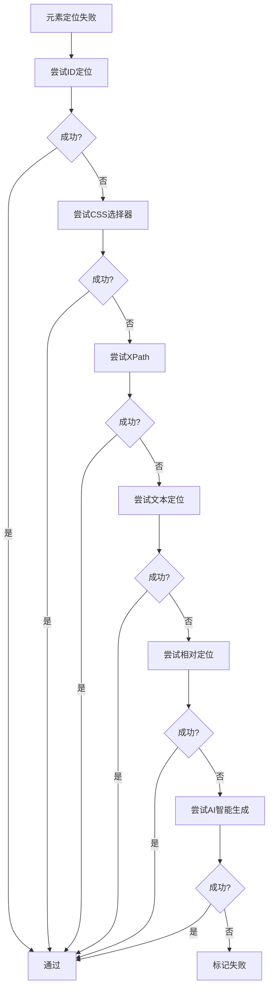

#### 10.4.2 智能定位修复示例

```javascript
const { test, expect } = require('@playwright/test');

class SmartElementLocator {
  constructor(page) {
    this.page = page;
    this.locatorStrategies = [
      { name: 'id', priority: 1 },
      { name: 'css', priority: 2 },
      { name: 'xpath', priority: 3 },
      { name: 'text', priority: 4 },
      { name: 'relative', priority: 5 },
      { name: 'ai_smart', priority: 6 }
    ];
  }

  async findElement(elementDescription) {
    const selectors = await this.generateSelectors(elementDescription);
    
    for (const strategy of this.locatorStrategies) {
      try {
        const locator = await this.createLocator(strategy, selectors);
        await locator.waitFor({ state: 'visible', timeout: 5000 });
        return locator;
      } catch (e) {
        continue;
      }
    }
    
    throw new Error(`无法找到元素: ${elementDescription}`);
  }

  async generateSelectors(description) {
    const response = await openai.chat.completions.create({
      model: 'gpt-4',
      messages: [{
        role: 'system',
        content: '根据元素描述生成多种选择器'
      }, {
        role: 'user',
        content: `元素描述: ${description}`
      }]
    });
    
    return JSON.parse(response.choices[0].message.content);
  }
}

test.describe('自我修复测试', () => {
  test('TC-AUTO-REPAIR-001: 登录页面元素定位修复', async ({ page }) => {
    const locator = new SmartElementLocator(page);
    
    await page.goto('https://admin.example.com/login');
    
    const emailInput = await locator.findElement('邮箱输入框');
    await emailInput.fill('test@example.com');
    
    const passwordInput = await locator.findElement('密码输入框');
    await passwordInput.fill('123456');
    
    const loginButton = await locator.findElement('登录按钮');
    await loginButton.click();
  });
});
```

### 10.5 断言动态修复

#### 10.5.1 断言修复策略

| 策略 | 描述 | 适用场景 |
|-----|------|---------|
| **弹性断言** | 使用模糊匹配替代精确匹配 | 文本格式变化 |
| **动态阈值** | 根据实际值动态调整阈值 | 数值范围波动 |
| **上下文断言** | 基于上下文验证而非精确值 | 动态数据 |
| **智能等待断言** | 等待条件满足再验证 | 异步加载 |

#### 10.5.2 动态断言示例

```javascript
const { test, expect } = require('@playwright/test');

class DynamicAssertion {
  static async assertWithTolerance(actual, expected, tolerance = 0.1) {
    if (typeof actual === 'number') {
      const diff = Math.abs(actual - expected);
      const percentDiff = diff / expected;
      expect(percentDiff).toBeLessThan(tolerance);
    } else {
      expect(actual).toContain(expected);
    }
  }

  static async assertWithSmartWait(page, selector, assertion, maxWait = 10000) {
    const startTime = Date.now();
    
    while (Date.now() - startTime < maxWait) {
      try {
        const element = page.locator(selector);
        const text = await element.textContent();
        if (assertion(text)) {
          return;
        }
      } catch (e) {
        // 继续等待
      }
      await page.waitForTimeout(500);
    }
    
    throw new Error(`智能断言超时: ${selector}`);
  }

  static convertToRegexAssertion(actual, expected) {
    if (expected instanceof RegExp) {
      expect(actual).toMatch(expected);
    } else if (typeof expected === 'string') {
      expect(actual).toContain(expected);
    } else if (typeof expected === 'number') {
      this.assertWithTolerance(actual, expected);
    }
  }
}

test('TC-ASSERTION-REPAIR-001: 动态断言示例', async ({ page }) => {
  await page.goto('https://admin.example.com/dashboard');
  
  const orderCount = await page.locator('.order-count').textContent();
  DynamicAssertion.convertToRegexAssertion(orderCount, /\d+/);
  
  await DynamicAssertion.assertWithSmartWait(
    page,
    '.user-name',
    (text) => text && text.length > 0
  );
});
```

### 10.6 MCP错误自动修复

#### 10.6.1 MCP错误处理流程

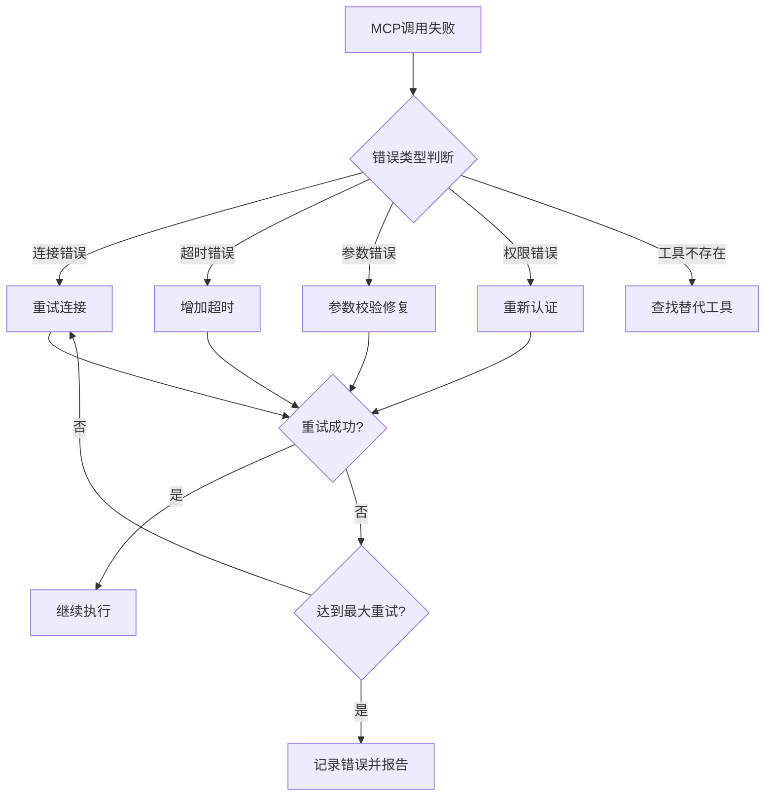

#### 10.6.2 MCP自动修复示例

```javascript
const { test, expect } = require('@playwright/test');
const { MCPClient } = require('@mcp/client');

class MCPAutoRepair {
  constructor() {
    this.retryConfig = {
      maxRetries: 3,
      retryDelay: 2000,
      backoffMultiplier: 2
    };
  }

  async callWithRetry(toolName, params, retryCount = 0) {
    try {
      return await mcpClient.callTool(toolName, params);
    } catch (error) {
      if (retryCount >= this.retryConfig.maxRetries) {
        throw new Error(`MCP调用失败，已重试${retryCount}次: ${error.message}`);
      }

      const repairedParams = await this.repairParams(error, toolName, params);
      await this.wait(this.retryConfig.retryDelay * Math.pow(this.retryConfig.backoffMultiplier, retryCount));

      return this.callWithRetry(toolName, repairedParams, retryCount + 1);
    }
  }

  async repairParams(error, toolName, params) {
    const errorType = this.classifyError(error.message);
    
    if (errorType === 'timeout') {
      params.timeout = (params.timeout || 10000) * 2;
    } else if (errorType === 'invalid_params') {
      const schema = await mcpClient.getToolSchema(toolName);
      return this.validateAndFixParams(params, schema);
    }
    
    return params;
  }

  classifyError(errorMessage) {
    if (errorMessage.includes('timeout')) return 'timeout';
    if (errorMessage.includes('invalid') || errorMessage.includes('parameter')) return 'invalid_params';
    if (errorMessage.includes('auth') || errorMessage.includes('permission')) return 'auth_error';
    if (errorMessage.includes('not found')) return 'not_found';
    return 'unknown';
  }

  wait(ms) {
    return new Promise(resolve => setTimeout(resolve, ms));
  }
}

test('TC-MCP-REPAIR-001: MCP自动修复测试', async ({ page }) => {
  const repair = new MCPAutoRepair();
  
  const loginResult = await repair.callWithRetry('auth-service', {
    action: 'login',
    email: 'test@example.com',
    password: '123456'
  });
  
  expect(loginResult.success).toBe(true);
});
```

### 10.7 修复验证机制

#### 10.7.1 修复验证流程

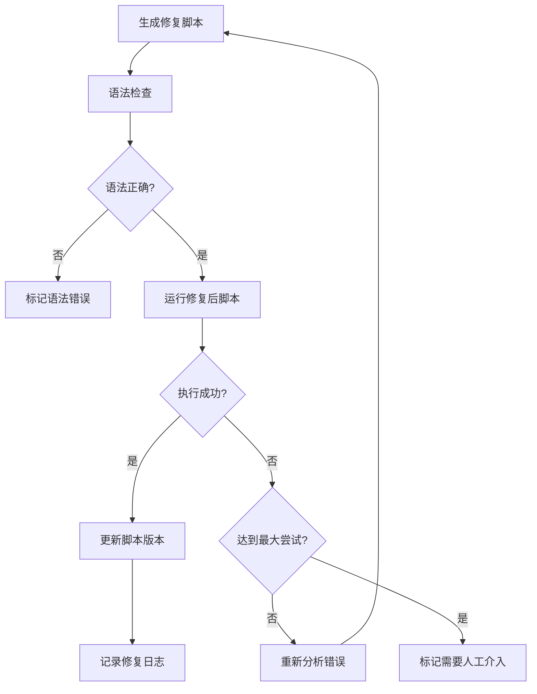

#### 10.7.2 修复验证配置

```json
{
  "repair_verification_config": {
    "syntax_check": {
      "enabled": true,
      "linter": "eslint",
      "auto_fix_syntax_errors": true
    },
    "execution_test": {
      "enabled": true,
      "timeout": "60s",
      "capture_screenshots": true,
      "capture_video": true
    },
    "regression_check": {
      "enabled": true,
      "run_related_tests": true,
      "compare_results": true
    },
    "approval_workflow": {
      "auto_approve_confident_repairs": true,
      "confidence_threshold": 0.9,
      "notify_on_repair": true,
      "approve_channels": ["email", "slack"]
    }
  }
}
```

### 10.8 修复日志与报告

#### 10.8.1 修复日志结构

```json
{
  "repair_log": {
    "repair_id": "REPAIR-20240115-001",
    "timestamp": "2024-01-15T10:30:00",
    "test_id": "TC-LOGIN-001",
    "original_error": {
      "type": "element_not_found",
      "message": "Cannot locate element with selector #email-input",
      "stack": "Error:...",
      "screenshot": "reports/screenshots/TC-LOGIN-001-failed.png"
    },
    "repair_attempts": [
      {
        "attempt": 1,
        "strategy": "smart_locator_regeneration",
        "confidence": 0.85,
        "new_script": "...",
        "result": "failed",
        "reason": "Element still not found"
      },
      {
        "attempt": 2,
        "strategy": "xpath_with_text",
        "confidence": 0.92,
        "new_script": "...",
        "result": "passed"
      }
    ],
    "final_repair": {
      "strategy_used": "xpath_with_text",
      "confidence": 0.92,
      "test_script": "...",
      "verified": true,
      "verified_at": "2024-01-15T10:31:00"
    },
    "status": "auto_repaired",
    "human_approval_required": false
  }
}
```

#### 10.8.2 修复报告示例

```markdown
## 自动化修复报告

### 执行摘要
- 总测试数: 150
- 失败数: 8
- 自动修复成功: 6
- 需要人工介入: 2
- 修复成功率: 75%

### 修复详情

| 测试ID | 错误类型 | 修复策略 | 尝试次数 | 状态 |
|-------|---------|---------|---------|------|
| TC-LOGIN-001 | 元素定位失败 | 智能定位 | 2 | ✅ 已修复 |
| TC-LOGIN-002 | 超时错误 | 等待策略调整 | 1 | ✅ 已修复 |
| TC-E2E-001 | 断言失败 | 动态断言 | 3 | ⚠️ 需人工 |
| TC-MCP-001 | MCP错误 | 工具重试 | 1 | ✅ 已修复 |

### 修复趋势
- 本周修复数: 25
- 上周修复数: 18
- 修复增长率: +38.9%
- 平均修复时间: 45秒
```

### 10.9 AI模型管理配置

#### 10.9.1 多模型配置

```json
{
  "ai_model_config": {
    "default_model": "deepseek-v4-flash",
    "fallback_models": [
      {
        "name": "gpt-4",
        "priority": 1,
        "enabled": true
      },
      {
        "name": "claude-3",
        "priority": 2,
        "enabled": true
      },
      {
        "name": "gemini-pro",
        "priority": 3,
        "enabled": true
      }
    ],
    "model_routing": {
      "requirement_parsing": "deepseek-v4-flash",
      "test_case_generation": "deepseek-v4-flash",
      "script_generation": "deepseek-v4-flash",
      "auto_repair": "deepseek-v4-flash",
      "code_review": "gpt-4",
      "mcp_integration": "deepseek-v4-flash"
    },
    "health_check": {
      "enabled": true,
      "interval": "5m",
      "check_endpoint": "/v1/models",
      "auto_switch_on_failure": true,
      "notify_on_switch": true
    },
    "retry_policy": {
      "max_retries": 3,
      "retry_delay": "2s",
      "exponential_backoff": true,
      "switch_model_on_failure": true
    },
    "performance": {
      "max_tokens": 4000,
      "temperature": 0.7,
      "response_timeout": "30s"
    }
  }
}
```

#### 10.9.2 模型健康监控

```javascript
class AIModelHealthMonitor {
  constructor(config) {
    this.models = config.fallback_models;
    this.currentModel = config.default_model;
    this.healthStatus = {};
    this.checkInterval = config.health_check.interval;
  }

  async checkModelHealth(modelName) {
    try {
      const response = await fetch(`${this.getModelEndpoint(modelName)}/health`, {
        method: 'GET',
        timeout: 5000
      });
      
      this.healthStatus[modelName] = {
        healthy: response.ok,
        responseTime: response.headers.get('X-Response-Time'),
        lastCheck: new Date()
      };
      
      return response.ok;
    } catch (error) {
      this.healthStatus[modelName] = {
        healthy: false,
        error: error.message,
        lastCheck: new Date()
      };
      return false;
    }
  }

  async switchToHealthyModel() {
    for (const model of this.models) {
      if (model.enabled && this.healthStatus[model.name]?.healthy) {
        if (model.name !== this.currentModel) {
          console.log(`切换AI模型: ${this.currentModel} -> ${model.name}`);
          this.currentModel = model.name;
        }
        return model.name;
      }
    }
    throw new Error('没有可用的AI模型');
  }

  async repairWithFallback(error) {
    let lastError = error;
    
    for (const model of this.models) {
      if (!model.enabled) continue;
      
      try {
        this.currentModel = model.name;
        return await this.executeRepair(error);
      } catch (modelError) {
        lastError = modelError;
        console.warn(`模型 ${model.name} 修复失败: ${modelError.message}`);
      }
    }
    
    throw new Error(`所有模型修复失败: ${lastError.message}`);
  }
}
```

---

## 十一、后续扩展方向

1. **多模态输入支持**：支持图片、设计稿输入
2. **智能断言生成**：根据需求自动生成断言
3. **测试数据生成**：AI自动生成测试数据
4. **缺陷预测**：基于历史数据预测高风险模块
5. **智能修复**：自动修复失败的测试脚本
6. **MCP生态扩展**：支持更多MCP工具和服务器
7. **测试编排优化**：基于AI的智能测试编排
8. **实时监控告警**：测试执行实时监控和异常告警

---

*文档版本: 2.0*  
*创建日期: 2024年1月*  
*更新日期: 2024年1月*  
*适用范围: AI驱动测试自动化平台*