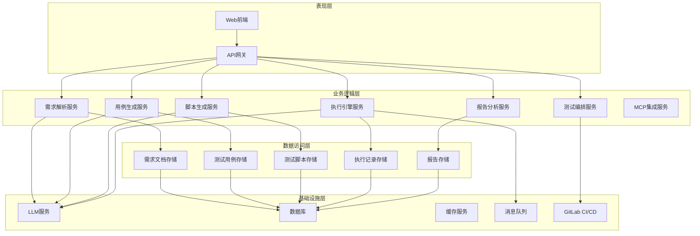
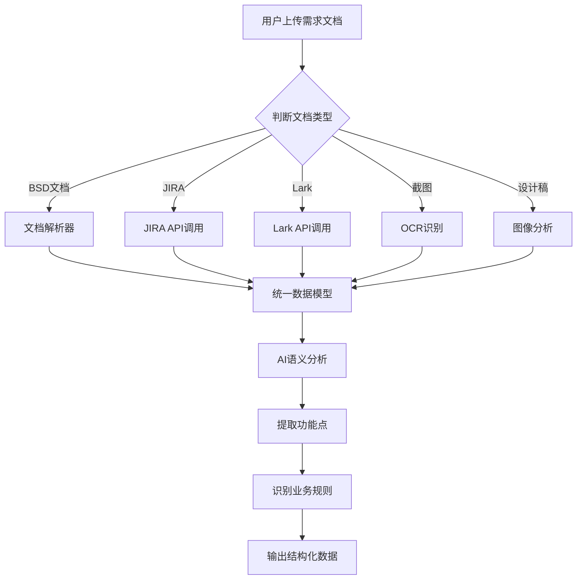
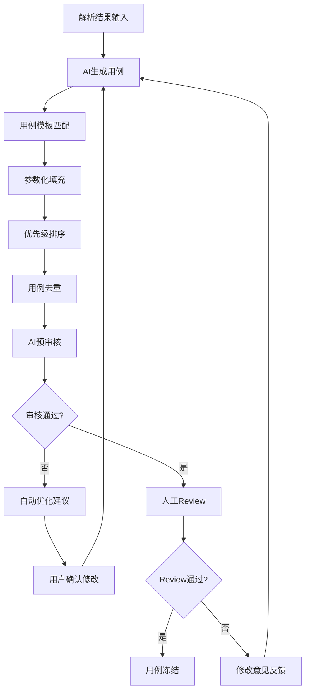
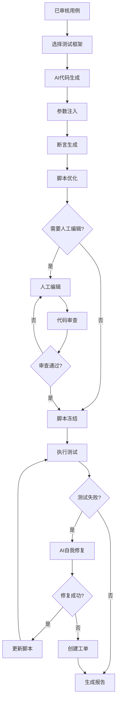
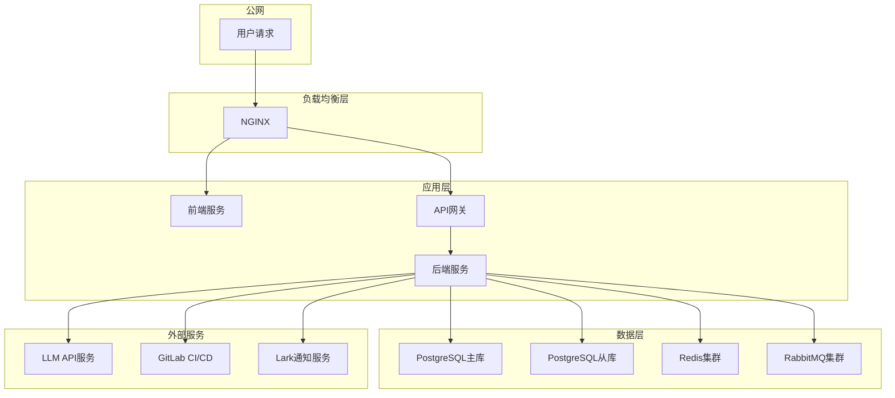

# AI驱动测试自动化平台 - 概要设计文档

## 1. 项目概述

### 1.1 项目背景
本项目旨在构建一个基于AI的测试自动化平台，实现从需求文档到测试执行的全流程自动化。平台利用大语言模型（LLM）技术，自动解析需求文档、生成测试用例、创建自动化脚本，并支持测试执行和结果分析。

### 1.2 项目目标
- **自动化测试用例生成**：基于需求文档自动生成高质量测试用例
- **智能脚本生成**：根据测试用例自动生成可执行的测试脚本
- **多源需求支持**：支持BSD文档、JIRA、Lark等多种需求来源
- **AI自我修复**：测试失败时自动尝试修复脚本
- **完整测试编排**：支持冒烟测试、E2E测试、回归测试

### 1.3 核心价值
| 价值点 | 描述 |
|-------|------|
| 效率提升 | 减少80%的测试用例编写时间 |
| 质量保证 | AI预审核确保用例质量 |
| 持续改进 | 测试结果反馈驱动持续优化 |
| 知识沉淀 | 测试资产结构化存储和复用 |

---

## 2. 整体架构设计

### 2.1 架构风格
采用分层架构模式，包含表现层、业务逻辑层、数据访问层和基础设施层。

### 2.2 模块划分

| 模块 | 职责 | 核心功能 |
|-----|------|---------|
| **需求解析模块** | 解析多源需求文档 | 文档解析、AI分析、结构化输出 |
| **用例生成模块** | 生成和管理测试用例 | AI生成、审核流程、用例管理 |
| **脚本生成模块** | 生成自动化测试脚本 | 代码生成、人工编辑、版本管理 |
| **测试编排模块** | 编排和执行测试 | 测试套件管理、并行执行、调度 |
| **执行引擎模块** | 执行测试脚本 | 脚本执行、结果收集、AI修复 |
| **报告分析模块** | 生成和展示报告 | 测试报告、趋势分析、通知推送 |
| **MCP集成模块** | 外部工具集成 | 工具调用、上下文管理 |

### 2.3 架构图



---

## 3. 核心业务流程

### 3.1 需求导入与解析流程



### 3.2 测试用例生成流程



### 3.3 脚本生成与执行流程



---

## 4. 关键技术选型

### 4.1 技术栈

| 分类 | 技术 | 版本 | 选型理由 |
|-----|------|------|---------|
| **前端框架** | React | 18.x | 成熟稳定，生态丰富 |
| **后端框架** | Spring Boot | 3.x | Java生态，企业级支持 |
| **数据库** | PostgreSQL | 15.x | 支持JSON字段，全文搜索 |
| **缓存** | Redis | 7.x | 高性能缓存，支持分布式锁 |
| **消息队列** | RabbitMQ | 3.x | 可靠消息传递，支持延迟队列 |
| **LLM服务** | DeepSeek-v4-flash | - | 高性能，支持多模型fallback |
| **测试框架** | Playwright | 1.x | 现代Web自动化，支持多浏览器 |
| **CI/CD** | GitLab CI | - | 与GitLab深度集成 |

### 4.2 AI模型配置

```json
{
  "primary_model": "deepseek-v4-flash",
  "fallback_models": ["gpt-4", "claude-3"],
  "api_keys": {
    "deepseek": "${DEEPSEEK_API_KEY}",
    "openai": "${OPENAI_API_KEY}",
    "anthropic": "${ANTHROPIC_API_KEY}"
  },
  "timeout": 60,
  "max_tokens": 8192
}
```

---

## 5. 部署架构

### 5.1 物理部署图



### 5.2 环境配置

| 环境 | 配置 | 用途 |
|-----|------|------|
| **开发环境** | 单节点部署 | 开发调试 |
| **测试环境** | 多节点部署 | 功能验证 |
| **生产环境** | 高可用集群 | 正式运行 |

---

## 6. 安全性考虑

### 6.1 安全措施

| 安全领域 | 措施 |
|---------|------|
| **身份认证** | JWT Token认证 |
| **授权管理** | RBAC权限控制 |
| **数据加密** | AES-256加密存储 |
| **API安全** | 接口限流、请求签名 |
| **日志审计** | 操作日志记录 |
| **敏感数据** | 脱敏处理 |

### 6.2 权限模型

| 角色 | 权限 |
|-----|------|
| **管理员** | 全部权限 |
| **测试负责人** | 用例审核、脚本管理、测试执行 |
| **测试人员** | 用例查看、脚本编辑、执行测试 |
| **开发人员** | 查看测试结果 |

---

## 7. 非功能需求

### 7.1 性能指标

| 指标 | 目标 |
|-----|------|
| 需求解析响应时间 | < 30秒 |
| 用例生成响应时间 | < 60秒 |
| 脚本生成响应时间 | < 30秒 |
| 测试执行并发数 | 支持100+并行 |
| 系统可用性 | 99.9% |

### 7.2 可扩展性

- 支持水平扩展
- 支持多租户部署
- 支持插件化架构

---

## 8. 交付物清单

| 交付物 | 描述 | 状态 |
|-------|------|------|
| 概要设计文档 | 本文档 | 完成 |
| 详细设计文档 | 技术实现细节 | 待完成 |
| 数据库设计文档 | 数据模型设计 | 待完成 |
| API文档 | 接口规范 | 待完成 |
| 架构决策记录 | ADR文档 | 待完成 |
| 测试用例 | 系统测试用例 | 待完成 |

---

**文档版本**: v1.0  
**创建日期**: 2026年5月  
**作者**: Alan  
**审核状态**: 待审核