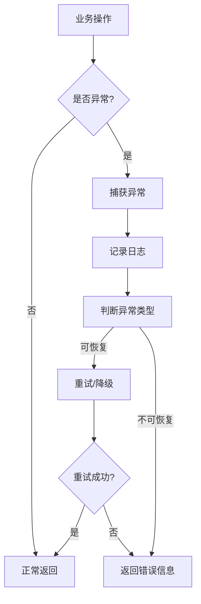

# AI驱动测试自动化平台 - 详细设计文档

## 1. 引言

### 1.1 文档目的
本文档详细描述AI驱动测试自动化平台的技术实现细节，包括模块设计、类设计、接口设计等。

### 1.2 文档范围
涵盖需求解析、用例生成、脚本生成、测试执行、报告分析等核心模块的详细设计。

---

## 2. 需求解析模块设计

### 2.1 模块概述
负责解析多源需求文档，将非结构化数据转换为结构化格式。

### 2.2 类设计

#### 2.2.1 DocumentParser（文档解析器）

| 类名 | DocumentParser |
|-----|---------------|
| 职责 | 解析不同类型的文档 |
| 所属文件 | `com.example.parser.DocumentParser.java` |

**方法列表**：

| 方法名 | 功能 | 参数 | 返回值 | 失败返回 |
|-------|------|------|--------|---------|
| `parse()` | 解析文档 | `input: InputStream`, `type: DocumentType` | `ParsedResult` | 抛出 `ParseException` |
| `extractText()` | 提取文本内容 | `input: InputStream` | `String` | 抛出 `ExtractException` |

#### 2.2.2 AIAnalyzer（AI分析器）

| 类名 | AIAnalyzer |
|-----|------------|
| 职责 | 使用LLM分析需求内容 |
| 所属文件 | `com.example.analyzer.AIAnalyzer.java` |

**方法列表**：

| 方法名 | 功能 | 参数 | 返回值 |
|-------|------|------|--------|
| `analyze()` | 分析需求文档 | `content: String`, `promptTemplate: String` | `AnalysisResult` |
| `extractFeatures()` | 提取功能点 | `content: String` | `List<Feature>` |
| `identifyRules()` | 识别业务规则 | `content: String` | `List<BusinessRule>` |

#### 2.2.3 JiraParser（JIRA解析器）

| 类名 | JiraParser |
|-----|-----------|
| 职责 | 解析JIRA需求 |
| 所属文件 | `com.example.parser.JiraParser.java` |

**方法列表**：

| 方法名 | 功能 | 参数 | 返回值 |
|-------|------|------|--------|
| `fetchIssues()` | 获取JIRA Issues | `projectKey: String`, `sprint: String` | `List<JiraIssue>` |
| `convertToRequirements()` | 转换为需求格式 | `issues: List<JiraIssue>` | `List<Requirement>` |

### 2.3 数据结构

#### 2.3.1 ParsedResult（解析结果）

```java
public class ParsedResult {
    private String documentId;
    private String title;
    private DocumentType type;
    private List<Feature> features;
    private List<BusinessRule> rules;
    private List<TestPoint> testPoints;
    private LocalDateTime parsedAt;
}
```

#### 2.3.2 Feature（功能点）

```java
public class Feature {
    private String id;
    private String name;
    private String description;
    private String module;
    private Priority priority;
    private List<String> acceptanceCriteria;
}
```

---

## 3. 测试用例生成模块设计

### 3.1 模块概述
根据解析结果自动生成测试用例，并管理审核流程。

### 3.2 类设计

#### 3.2.1 TestCaseGenerator（用例生成器）

| 类名 | TestCaseGenerator |
|-----|-------------------|
| 职责 | AI生成测试用例 |
| 所属文件 | `com.example.generator.TestCaseGenerator.java` |

**方法列表**：

| 方法名 | 功能 | 参数 | 返回值 |
|-------|------|------|--------|
| `generate()` | 生成测试用例 | `features: List<Feature>` | `List<TestCase>` |
| `generateByType()` | 按类型生成 | `features: List<Feature>`, `type: TestType` | `List<TestCase>` |

#### 3.2.2 CaseReviewer（用例审核器）

| 类名 | CaseReviewer |
|-----|-------------|
| 职责 | 审核测试用例 |
| 所属文件 | `com.example.reviewer.CaseReviewer.java` |

**方法列表**：

| 方法名 | 功能 | 参数 | 返回值 |
|-------|------|------|--------|
| `preReview()` | AI预审核 | `cases: List<TestCase>` | `ReviewResult` |
| `humanReview()` | 人工审核 | `caseId: String`, `reviewer: String`, `status: ReviewStatus` | `void` |

### 3.3 数据结构

#### 3.3.1 TestCase（测试用例）

```java
public class TestCase {
    private String caseId;
    private String module;
    private String title;
    private TestType type;
    private String category;
    private Priority priority;
    private List<String> preconditions;
    private Map<String, Object> testData;
    private List<TestStep> testSteps;
    private String expectedResult;
    private String actualResult;
    private List<String> postconditions;
    private List<String> tags;
    private String estimatedTime;
    private McpConfig mcpConfig;
    private CaseStatus status;
    private LocalDateTime createdAt;
    private LocalDateTime updatedAt;
}
```

#### 3.3.2 TestStep（测试步骤）

```java
public class TestStep {
    private Integer order;
    private String step;
    private String expected;
    private String actual;
}
```

---

## 4. 脚本生成模块设计

### 4.1 模块概述
根据测试用例自动生成自动化测试脚本，支持人工编辑和版本管理。

### 4.2 类设计

#### 4.2.1 ScriptGenerator（脚本生成器）

| 类名 | ScriptGenerator |
|-----|-----------------|
| 职责 | AI生成测试脚本 |
| 所属文件 | `com.example.generator.ScriptGenerator.java` |

**方法列表**：

| 方法名 | 功能 | 参数 | 返回值 |
|-------|------|------|--------|
| `generate()` | 生成脚本 | `testCase: TestCase`, `framework: FrameworkType` | `TestScript` |
| `batchGenerate()` | 批量生成 | `cases: List<TestCase>`, `framework: FrameworkType` | `List<TestScript>` |

#### 4.2.2 ScriptEditor（脚本编辑器）

| 类名 | ScriptEditor |
|-----|-------------|
| 职责 | 编辑和优化脚本 |
| 所属文件 | `com.example.editor.ScriptEditor.java` |

**方法列表**：

| 方法名 | 功能 | 参数 | 返回值 |
|-------|------|------|--------|
| `edit()` | 编辑脚本 | `scriptId: String`, `code: String` | `TestScript` |
| `optimize()` | AI优化脚本 | `script: TestScript` | `TestScript` |

#### 4.2.3 VersionManager（版本管理器）

| 类名 | VersionManager |
|-----|---------------|
| 职责 | 管理脚本版本 |
| 所属文件 | `com.example.version.VersionManager.java` |

**方法列表**：

| 方法名 | 功能 | 参数 | 返回值 |
|-------|------|------|--------|
| `saveVersion()` | 保存版本 | `scriptId: String`, `code: String`, `author: String` | `Version` |
| `getHistory()` | 获取版本历史 | `scriptId: String` | `List<Version>` |
| `rollback()` | 回滚版本 | `scriptId: String`, `versionId: String` | `TestScript` |

### 4.3 数据结构

#### 4.3.1 TestScript（测试脚本）

```java
public class TestScript {
    private String id;
    private String caseId;
    private FrameworkType framework;
    private String code;
    private String version;
    private ScriptStatus status;
    private Boolean isAiGenerated;
    private String createdBy;
    private String updatedBy;
    private LocalDateTime createdAt;
    private LocalDateTime updatedAt;
}
```

#### 4.3.1 Version（版本）

```java
public class Version {
    private String id;
    private String scriptId;
    private String version;
    private String code;
    private ChangeType changeType;
    private String author;
    private String comment;
    private LocalDateTime createdAt;
}
```

---

## 5. 测试执行模块设计

### 5.1 模块概述
编排和执行测试脚本，收集执行结果，支持AI自我修复。

### 5.2 类设计

#### 5.2.1 TestOrchestrator（测试编排器）

| 类名 | TestOrchestrator |
|-----|------------------|
| 职责 | 编排测试套件 |
| 所属文件 | `com.example.orchestrator.TestOrchestrator.java` |

**方法列表**：

| 方法名 | 功能 | 参数 | 返回值 |
|-------|------|------|--------|
| `createSuite()` | 创建测试套件 | `name: String`, `scriptIds: List<String>` | `TestSuite` |
| `executeSuite()` | 执行测试套件 | `suiteId: String` | `ExecutionResult` |

#### 5.2.2 ExecutionEngine（执行引擎）

| 类名 | ExecutionEngine |
|-----|-----------------|
| 职责 | 执行测试脚本 |
| 所属文件 | `com.example.engine.ExecutionEngine.java` |

**方法列表**：

| 方法名 | 功能 | 参数 | 返回值 |
|-------|------|------|--------|
| `execute()` | 执行单个脚本 | `script: TestScript` | `ExecutionRecord` |
| `executeParallel()` | 并行执行 | `scripts: List<TestScript>`, `parallelCount: Integer` | `List<ExecutionRecord>` |

#### 5.2.3 AISelfRepair（AI自我修复）

| 类名 | AISelfRepair |
|-----|--------------|
| 职责 | 自动修复失败脚本 |
| 所属文件 | `com.example.repair.AISelfRepair.java` |

**方法列表**：

| 方法名 | 功能 | 参数 | 返回值 |
|-------|------|------|--------|
| `analyzeError()` | 分析错误 | `executionRecord: ExecutionRecord` | `ErrorAnalysis` |
| `repair()` | 修复脚本 | `script: TestScript`, `errors: List<Error>` | `TestScript` |
| `verify()` | 验证修复 | `script: TestScript` | `Boolean` |

### 5.3 数据结构

#### 5.3.1 ExecutionRecord（执行记录）

```java
public class ExecutionRecord {
    private String id;
    private String scriptId;
    private ExecutionType executionType;
    private ExecutionStatus status;
    private String errorMessage;
    private Integer duration;
    private Integer retryCount;
    private Boolean aiRepaired;
    private Integer repairAttempts;
    private LocalDateTime createdAt;
}
```

---

## 6. 报告分析模块设计

### 6.1 模块概述
生成测试报告，分析测试结果，发送通知。

### 6.2 类设计

#### 6.2.1 ReportGenerator（报告生成器）

| 类名 | ReportGenerator |
|-----|-----------------|
| 职责 | 生成测试报告 |
| 所属文件 | `com.example.report.ReportGenerator.java` |

**方法列表**：

| 方法名 | 功能 | 参数 | 返回值 |
|-------|------|------|--------|
| `generate()` | 生成报告 | `executionIds: List<String>` | `TestReport` |
| `generateSummary()` | 生成摘要 | `startDate: LocalDate`, `endDate: LocalDate` | `ReportSummary` |

#### 6.2.2 NotificationService（通知服务）

| 类名 | NotificationService |
|-----|---------------------|
| 职责 | 发送测试通知 |
| 所属文件 | `com.example.notification.NotificationService.java` |

**方法列表**：

| 方法名 | 功能 | 参数 | 返回值 |
|-------|------|------|--------|
| `sendLarkNotification()` | 发送Lark通知 | `message: LarkMessage` | `void` |
| `sendEmailNotification()` | 发送邮件通知 | `message: EmailMessage` | `void` |

### 6.3 数据结构

#### 6.3.1 TestReport（测试报告）

```java
public class TestReport {
    private String id;
    private String name;
    private Integer totalCases;
    private Integer passedCount;
    private Integer failedCount;
    private Integer skippedCount;
    private Double passRate;
    private List<ExecutionRecord> records;
    private LocalDateTime generatedAt;
}
```

---

## 7. MCP集成模块设计

### 7.1 模块概述
支持MCP协议集成，实现外部工具调用。

### 7.2 类设计

#### 7.2.1 McpClient（MCP客户端）

| 类名 | McpClient |
|-----|----------|
| 职责 | MCP协议客户端 |
| 所属文件 | `com.example.mcp.McpClient.java` |

**方法列表**：

| 方法名 | 功能 | 参数 | 返回值 |
|-------|------|------|--------|
| `callTool()` | 调用工具 | `toolName: String`, `params: Map<String, Object>` | `ToolResult` |
| `validateContext()` | 验证上下文 | `context: McpContext` | `Boolean` |

#### 7.2.2 McpConfig（MCP配置）

```java
public class McpConfig {
    private Boolean enabled;
    private List<McpTool> tools;
    private List<String> contextValidation;
}
```

---

## 8. 数据库交互设计

### 8.1 数据访问层结构

| 类名 | 职责 | 所属文件 |
|-----|------|---------|
| `RequirementRepository` | 需求数据访问 | `com.example.repository.RequirementRepository.java` |
| `TestCaseRepository` | 测试用例数据访问 | `com.example.repository.TestCaseRepository.java` |
| `TestScriptRepository` | 测试脚本数据访问 | `com.example.repository.TestScriptRepository.java` |
| `ExecutionRecordRepository` | 执行记录数据访问 | `com.example.repository.ExecutionRecordRepository.java` |
| `ReportRepository` | 报告数据访问 | `com.example.repository.ReportRepository.java` |

### 8.2 查询示例

#### 8.2.1 查询待审核用例

```java
@Query("SELECT tc FROM TestCase tc WHERE tc.status = :status")
List<TestCase> findByStatus(@Param("status") CaseStatus status);
```

#### 8.2.2 查询脚本版本历史

```java
@Query("SELECT v FROM Version v WHERE v.scriptId = :scriptId ORDER BY v.createdAt DESC")
List<Version> findByScriptIdOrderByCreatedAtDesc(@Param("scriptId") String scriptId);
```

---

## 9. 错误处理设计

### 9.1 异常类型

| 异常类 | 用途 | 触发场景 |
|-------|------|---------|
| `ParseException` | 文档解析异常 | 文档格式错误、解析失败 |
| `AnalysisException` | AI分析异常 | LLM调用失败、响应超时 |
| `ValidationException` | 数据验证异常 | 参数校验失败 |
| `ExecutionException` | 测试执行异常 | 脚本执行失败 |
| `RepairException` | 修复异常 | AI修复失败 |

### 9.2 异常处理流程



---

**文档版本**: v1.0  
**创建日期**: 2026年5月  
**作者**: Alan 
**审核状态**: 待审核