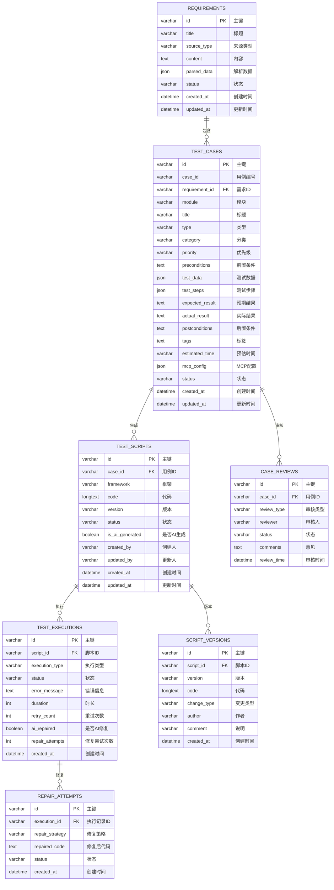
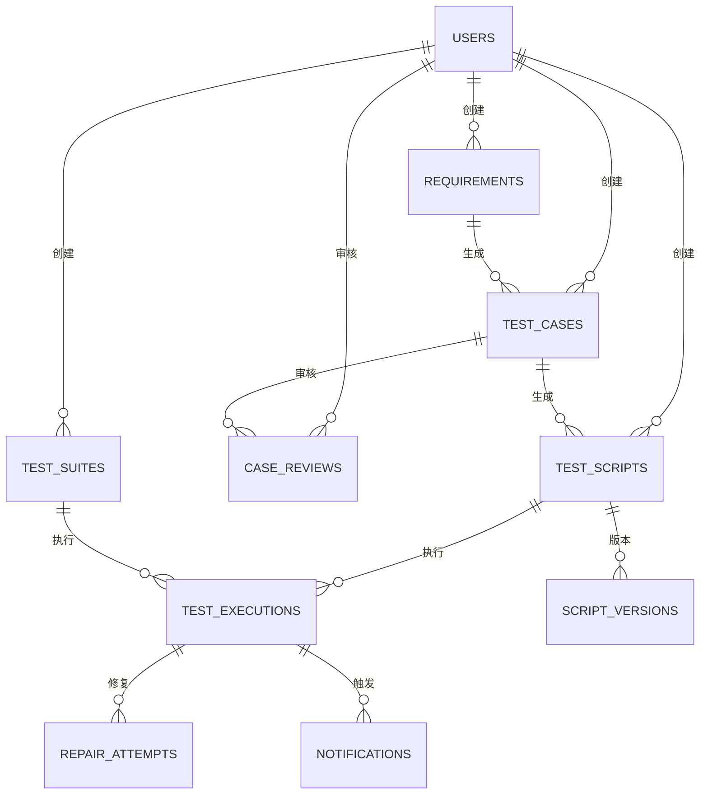

# AI驱动测试自动化平台 - 数据库设计文档

## 1. 引言

### 1.1 文档目的
本文档详细描述AI驱动测试自动化平台的数据库设计，包括数据表结构、字段定义、索引设计、ER关系等。

### 1.2 数据库选择
采用 PostgreSQL 15.x 作为数据库管理系统，理由如下：
- 支持 JSON 字段类型，适合存储半结构化数据
- 支持全文搜索功能
- 成熟稳定，适合企业级应用
- 良好的扩展性和性能

---

## 2. 数据库整体结构

### 2.1 数据库命名规范
- 数据库名：`ai_test_platform`
- 表名：采用小写蛇形命名，如 `requirements`, `test_cases`
- 字段名：采用小写蛇形命名，如 `case_id`, `test_data`

### 2.2 表关系总览



---

## 3. 数据表详细设计

### 3.1 需求文档表 (`requirements`)

| 字段名 | 类型 | 约束 | 说明 |
|-------|------|------|------|
| `id` | VARCHAR(36) | PRIMARY KEY | 需求文档唯一标识（UUID） |
| `title` | VARCHAR(255) | NOT NULL | 文档标题 |
| `source_type` | VARCHAR(50) | NOT NULL | 来源类型：BSD/JIRA/LARK/MARKDOWN/SCREENSHOT/AXURE/FIGMA/MODAO/EXCEL |
| `content` | TEXT | NOT NULL | 文档原始内容 |
| `parsed_data` | JSON | NULL | AI解析后的结构化数据 |
| `status` | VARCHAR(20) | NOT NULL DEFAULT 'pending' | 状态：pending/parsing/parsed/analyzing/analyzed/error |
| `source_url` | VARCHAR(500) | NULL | 来源URL（JIRA/Lark/Figma等） |
| `project_id` | VARCHAR(36) | NULL | 关联项目ID |
| `created_by` | VARCHAR(100) | NULL | 创建人 |
| `created_at` | TIMESTAMP | NOT NULL DEFAULT CURRENT_TIMESTAMP | 创建时间 |
| `updated_at` | TIMESTAMP | NOT NULL DEFAULT CURRENT_TIMESTAMP | 更新时间 |

**索引设计**：
- `idx_requirements_status` (status)
- `idx_requirements_source_type` (source_type)
- `idx_requirements_project_id` (project_id)

---

### 3.2 测试用例表 (`test_cases`)

| 字段名 | 类型 | 约束 | 说明 |
|-------|------|------|------|
| `id` | VARCHAR(36) | PRIMARY KEY | 用例唯一标识（UUID） |
| `case_id` | VARCHAR(50) | UNIQUE | 用例编号：TC-xxx-xxx |
| `requirement_id` | VARCHAR(36) | FOREIGN KEY REFERENCES requirements(id) | 关联需求文档ID |
| `module` | VARCHAR(100) | NOT NULL | 所属模块 |
| `title` | VARCHAR(255) | NOT NULL | 用例标题 |
| `type` | VARCHAR(50) | NOT NULL | 用例类型：功能测试/E2E测试/回归测试/冒烟测试/性能测试/安全测试 |
| `category` | VARCHAR(50) | NOT NULL | 分类：smoke/e2e/regression/performance/security |
| `priority` | VARCHAR(10) | NOT NULL | 优先级：P0/P1/P2 |
| `preconditions` | TEXT | NULL | 前置条件（JSON数组） |
| `test_data` | JSON | NULL | 测试数据（JSON对象） |
| `test_steps` | JSON | NOT NULL | 测试步骤（JSON数组） |
| `expected_result` | TEXT | NULL | 预期结果 |
| `actual_result` | TEXT | NULL | 实际结果 |
| `postconditions` | TEXT | NULL | 后置条件（JSON数组） |
| `tags` | TEXT | NULL | 标签（JSON数组） |
| `estimated_time` | VARCHAR(20) | NULL | 预估执行时间 |
| `mcp_config` | JSON | NULL | MCP配置 |
| `related_bug` | VARCHAR(50) | NULL | 关联缺陷ID |
| `status` | VARCHAR(20) | NOT NULL DEFAULT 'draft' | 状态：draft/reviewing/approved/rejected/frozen |
| `created_by` | VARCHAR(100) | NULL | 创建人 |
| `updated_by` | VARCHAR(100) | NULL | 更新人 |
| `created_at` | TIMESTAMP | NOT NULL DEFAULT CURRENT_TIMESTAMP | 创建时间 |
| `updated_at` | TIMESTAMP | NOT NULL DEFAULT CURRENT_TIMESTAMP | 更新时间 |

**索引设计**：
- `idx_test_cases_case_id` (case_id)
- `idx_test_cases_requirement_id` (requirement_id)
- `idx_test_cases_module` (module)
- `idx_test_cases_status` (status)
- `idx_test_cases_priority` (priority)
- `idx_test_cases_category` (category)

---

### 3.3 测试脚本表 (`test_scripts`)

| 字段名 | 类型 | 约束 | 说明 |
|-------|------|------|------|
| `id` | VARCHAR(36) | PRIMARY KEY | 脚本唯一标识（UUID） |
| `case_id` | VARCHAR(36) | FOREIGN KEY REFERENCES test_cases(id) | 关联测试用例ID |
| `framework` | VARCHAR(50) | NOT NULL | 测试框架：playwright/selenium/rest-assured/postman/mcp |
| `code` | LONGTEXT | NOT NULL | 脚本代码 |
| `version` | VARCHAR(20) | NOT NULL DEFAULT 'v1.0' | 版本号 |
| `status` | VARCHAR(20) | NOT NULL DEFAULT 'generated' | 状态：generated/edited/reviewing/reviewed/frozen/executing/passed/failed |
| `is_ai_generated` | BOOLEAN | NOT NULL DEFAULT TRUE | 是否AI生成 |
| `created_by` | VARCHAR(100) | NULL | 创建人 |
| `updated_by` | VARCHAR(100) | NULL | 更新人 |
| `created_at` | TIMESTAMP | NOT NULL DEFAULT CURRENT_TIMESTAMP | 创建时间 |
| `updated_at` | TIMESTAMP | NOT NULL DEFAULT CURRENT_TIMESTAMP | 更新时间 |

**索引设计**：
- `idx_test_scripts_case_id` (case_id)
- `idx_test_scripts_framework` (framework)
- `idx_test_scripts_status` (status)

---

### 3.4 测试执行记录表 (`test_executions`)

| 字段名 | 类型 | 约束 | 说明 |
|-------|------|------|------|
| `id` | VARCHAR(36) | PRIMARY KEY | 执行记录唯一标识（UUID） |
| `script_id` | VARCHAR(36) | FOREIGN KEY REFERENCES test_scripts(id) | 关联测试脚本ID |
| `execution_type` | VARCHAR(50) | NOT NULL | 执行类型：smoke/e2e/regression/scheduled/manual |
| `status` | VARCHAR(20) | NOT NULL DEFAULT 'running' | 状态：running/passed/failed/skipped |
| `error_message` | TEXT | NULL | 错误信息 |
| `duration` | INTEGER | NULL | 执行时长（秒） |
| `retry_count` | INTEGER | NOT NULL DEFAULT 0 | 重试次数 |
| `ai_repaired` | BOOLEAN | NOT NULL DEFAULT FALSE | 是否AI修复 |
| `repair_attempts` | INTEGER | NOT NULL DEFAULT 0 | AI修复尝试次数 |
| `environment` | VARCHAR(100) | NULL | 执行环境：dev/test/prod |
| `created_at` | TIMESTAMP | NOT NULL DEFAULT CURRENT_TIMESTAMP | 创建时间 |

**索引设计**：
- `idx_test_executions_script_id` (script_id)
- `idx_test_executions_status` (status)
- `idx_test_executions_execution_type` (execution_type)
- `idx_test_executions_created_at` (created_at)

---

### 3.5 用例审核记录表 (`case_reviews`)

| 字段名 | 类型 | 约束 | 说明 |
|-------|------|------|------|
| `id` | VARCHAR(36) | PRIMARY KEY | 审核记录唯一标识（UUID） |
| `case_id` | VARCHAR(36) | FOREIGN KEY REFERENCES test_cases(id) | 关联测试用例ID |
| `review_type` | VARCHAR(20) | NOT NULL | 审核类型：ai_pre_review/human_review |
| `reviewer` | VARCHAR(100) | NOT NULL | 审核人 |
| `status` | VARCHAR(20) | NOT NULL | 审核状态：approved/rejected/pending |
| `comments` | TEXT | NULL | 审核意见 |
| `review_time` | TIMESTAMP | NOT NULL DEFAULT CURRENT_TIMESTAMP | 审核时间 |

**索引设计**：
- `idx_case_reviews_case_id` (case_id)
- `idx_case_reviews_review_type` (review_type)
- `idx_case_reviews_reviewer` (reviewer)

---

### 3.6 脚本版本表 (`script_versions`)

| 字段名 | 类型 | 约束 | 说明 |
|-------|------|------|------|
| `id` | VARCHAR(36) | PRIMARY KEY | 版本记录唯一标识（UUID） |
| `script_id` | VARCHAR(36) | FOREIGN KEY REFERENCES test_scripts(id) | 关联测试脚本ID |
| `version` | VARCHAR(20) | NOT NULL | 版本号 |
| `code` | LONGTEXT | NOT NULL | 该版本代码 |
| `change_type` | VARCHAR(20) | NOT NULL | 变更类型：create/edit/repair |
| `author` | VARCHAR(100) | NOT NULL | 作者 |
| `comment` | VARCHAR(500) | NULL | 变更说明 |
| `created_at` | TIMESTAMP | NOT NULL DEFAULT CURRENT_TIMESTAMP | 创建时间 |

**索引设计**：
- `idx_script_versions_script_id` (script_id)
- `idx_script_versions_version` (script_id, version)

---

### 3.7 AI修复尝试表 (`repair_attempts`)

| 字段名 | 类型 | 约束 | 说明 |
|-------|------|------|------|
| `id` | VARCHAR(36) | PRIMARY KEY | 修复记录唯一标识（UUID） |
| `execution_id` | VARCHAR(36) | FOREIGN KEY REFERENCES test_executions(id) | 关联执行记录ID |
| `repair_strategy` | VARCHAR(100) | NULL | 修复策略 |
| `error_analysis` | TEXT | NULL | 错误分析结果 |
| `repaired_code` | LONGTEXT | NULL | 修复后的代码 |
| `status` | VARCHAR(20) | NOT NULL DEFAULT 'attempting' | 状态：attempting/success/failed |
| `created_at` | TIMESTAMP | NOT NULL DEFAULT CURRENT_TIMESTAMP | 创建时间 |

**索引设计**：
- `idx_repair_attempts_execution_id` (execution_id)
- `idx_repair_attempts_status` (status)

---

### 3.8 测试套件表 (`test_suites`)

| 字段名 | 类型 | 约束 | 说明 |
|-------|------|------|------|
| `id` | VARCHAR(36) | PRIMARY KEY | 套件唯一标识（UUID） |
| `name` | VARCHAR(255) | NOT NULL | 套件名称 |
| `description` | TEXT | NULL | 套件描述 |
| `type` | VARCHAR(50) | NOT NULL | 套件类型：smoke/e2e/regression/custom |
| `script_ids` | TEXT | NOT NULL | 包含的脚本ID（JSON数组） |
| `schedule_cron` | VARCHAR(100) | NULL | 定时执行Cron表达式 |
| `status` | VARCHAR(20) | NOT NULL DEFAULT 'active' | 状态：active/inactive |
| `created_by` | VARCHAR(100) | NULL | 创建人 |
| `created_at` | TIMESTAMP | NOT NULL DEFAULT CURRENT_TIMESTAMP | 创建时间 |
| `updated_at` | TIMESTAMP | NOT NULL DEFAULT CURRENT_TIMESTAMP | 更新时间 |

**索引设计**：
- `idx_test_suites_type` (type)
- `idx_test_suites_status` (status)

---

### 3.9 用户表 (`users`)

| 字段名 | 类型 | 约束 | 说明 |
|-------|------|------|------|
| `id` | VARCHAR(36) | PRIMARY KEY | 用户唯一标识（UUID） |
| `username` | VARCHAR(100) | UNIQUE NOT NULL | 用户名 |
| `email` | VARCHAR(255) | UNIQUE NOT NULL | 邮箱 |
| `password_hash` | VARCHAR(255) | NOT NULL | 密码哈希 |
| `role` | VARCHAR(50) | NOT NULL | 角色：admin/test_manager/tester/developer |
| `status` | VARCHAR(20) | NOT NULL DEFAULT 'active' | 状态：active/inactive |
| `created_at` | TIMESTAMP | NOT NULL DEFAULT CURRENT_TIMESTAMP | 创建时间 |
| `updated_at` | TIMESTAMP | NOT NULL DEFAULT CURRENT_TIMESTAMP | 更新时间 |

**索引设计**：
- `idx_users_username` (username)
- `idx_users_email` (email)
- `idx_users_role` (role)

---

### 3.10 通知记录表 (`notifications`)

| 字段名 | 类型 | 约束 | 说明 |
|-------|------|------|------|
| `id` | VARCHAR(36) | PRIMARY KEY | 通知唯一标识（UUID） |
| `type` | VARCHAR(50) | NOT NULL | 通知类型：test_failed/test_completed/review_required |
| `target_type` | VARCHAR(50) | NOT NULL | 目标类型：lark/email/webhook |
| `target_config` | JSON | NULL | 目标配置 |
| `message` | TEXT | NOT NULL | 通知消息内容 |
| `status` | VARCHAR(20) | NOT NULL DEFAULT 'pending' | 状态：pending/sent/failed |
| `related_id` | VARCHAR(36) | NULL | 关联业务ID（如执行记录ID） |
| `created_at` | TIMESTAMP | NOT NULL DEFAULT CURRENT_TIMESTAMP | 创建时间 |
| `sent_at` | TIMESTAMP | NULL | 发送时间 |

**索引设计**：
- `idx_notifications_type` (type)
- `idx_notifications_status` (status)

---

## 4. ER图



---

## 5. 数据库初始化脚本

### 5.1 创建数据库

```sql
CREATE DATABASE ai_test_platform
  WITH OWNER = postgres
       ENCODING = 'UTF8'
       LC_COLLATE = 'zh_CN.UTF-8'
       LC_CTYPE = 'zh_CN.UTF-8'
       TABLESPACE = pg_default
       CONNECTION LIMIT = -1;
```

### 5.2 创建扩展

```sql
CREATE EXTENSION IF NOT EXISTS "uuid-ossp";
CREATE EXTENSION IF NOT EXISTS "pg_trgm";
```

### 5.3 创建表（简化示例）

```sql
CREATE TABLE requirements (
    id VARCHAR(36) PRIMARY KEY DEFAULT uuid_generate_v4(),
    title VARCHAR(255) NOT NULL,
    source_type VARCHAR(50) NOT NULL,
    content TEXT NOT NULL,
    parsed_data JSON,
    status VARCHAR(20) NOT NULL DEFAULT 'pending',
    source_url VARCHAR(500),
    project_id VARCHAR(36),
    created_by VARCHAR(100),
    created_at TIMESTAMP NOT NULL DEFAULT CURRENT_TIMESTAMP,
    updated_at TIMESTAMP NOT NULL DEFAULT CURRENT_TIMESTAMP
);

CREATE INDEX idx_requirements_status ON requirements(status);
CREATE INDEX idx_requirements_source_type ON requirements(source_type);
```

---

## 6. 数据字典

### 6.1 状态枚举

#### 需求文档状态

| 值 | 说明 |
|---|------|
| `pending` | 待解析 |
| `parsing` | 解析中 |
| `parsed` | 已解析 |
| `analyzing` | 分析中 |
| `analyzed` | 已分析 |
| `error` | 错误 |

#### 测试用例状态

| 值 | 说明 |
|---|------|
| `draft` | 草稿 |
| `reviewing` | 审核中 |
| `approved` | 已通过 |
| `rejected` | 已拒绝 |
| `frozen` | 已冻结 |

#### 测试脚本状态

| 值 | 说明 |
|---|------|
| `generated` | AI已生成 |
| `edited` | 已编辑 |
| `reviewing` | 审查中 |
| `reviewed` | 已审查 |
| `frozen` | 已冻结 |
| `executing` | 执行中 |
| `passed` | 通过 |
| `failed` | 失败 |

#### 执行状态

| 值 | 说明 |
|---|------|
| `running` | 执行中 |
| `passed` | 通过 |
| `failed` | 失败 |
| `skipped` | 跳过 |

---

**文档版本**: v1.0  
**创建日期**: 2026年5月  
**作者**: Alan  
**审核状态**: 待审核